# Conet Tactile — 하드웨어 빌드 가이드 (공동창업자 전용)

> **읽는 사람**: 공동창업자. 하드웨어를 한 번도 안 만져본 사람. LED 극성이 뭔지 모르고, "납땜" 을 명사로만 알고 동사로는 안 써본 사람. 괜찮음. 형이 그 수준 가정하고 씀.
> **쓴 사람**: 형. CEO 겸 기획자 겸 SW 총괄 겸 PCB schematic 다 그린 사람 겸 이 문서 쓴 사람 겸 방금 결제 모듈도 스트라이프로 갈아끼운 사람. 즉, 너 빼고 다 한 사람.
> **목적**: 너 이거 보고 부품 발주하고, PCB 위탁 조립 시키고, 도착하면 펌웨어 굽고, 우리 백엔드에 데이터 박히는 거까지 **혼자** 다 하게 만드는 거. 어렵지 않음. 형이 어려운 거 다 끝냈음. 너한테 남은 건 초등학교 실과 수업 수준임. 진짜임.
> **톤**: 친절하지만 약은 올림. 너 일 안 한다는 거 형이랑 너 둘 다 알고 있음. 근데 이번엔 진짜 해야 함. 그래도 사랑은 함. 많이 함.
> **약속**: 이 문서는 "이거 모르겠지?" 하는 부분마다 형이 미리 멈춰서서 손잡고 알려줌. 네가 막힐 곳을 형이 이미 다 알고 있음. 왜? 형이 먼저 다 해봤으니까. 그러니까 **이대로만 따라하면 안 될 수가 없음.** 안 되면 그건 문서 잘못이 아니라 네가 줄 하나 건너뛴 거임. 건너뛰지 마.
>
> **글자 읽기 싫으면 그림만 봐도 됨.** 형이 핵심 단계마다 그림 그려놨음 (전체 흐름 / 발주 지도 / 발주 타임라인 / 깔판 단면 / 격자 치수 / 멀티미터 검사 / PCB 연결 / Edge 셋업 5단계 / Edge 박스 조립 / 키오스크). 그림에 화살표랑 숫자 다 있음. 진짜 그림만 보고 따라해도 1대 나오게 해놨음. 제발 그림이라도 봐.
>
> ---
>
> 이 문서랑 별개로 [`HOW_IT_WORKS.md`](./HOW_IT_WORKS.md) 는 "이게 도대체 뭐냐" 를 누구나 이해할 수 있게 설명하는 문서고, [`BOM.md`](./BOM.md) 는 양산 단가 기준 BOM. 이 문서 (`HARDWARE_BUILD_GUIDE.md`) 는 "**너** 진짜로 1대 만들어라" 용임. 다른 문서 핑계 대지 마. 이거 한 개만 보면 됨.

---

## 0. 시작하기 전에 — 너 지금 뭐하는 건지 알고 시작해라

형이 제일 무서운 게 뭔지 알아? 네가 이 0번 섹션 안 읽고 2번 섹션 (쇼핑 리스트) 으로 바로 스크롤 내려서 카드부터 긁는 거. 그러지 마. 30초만 참아. 30초.

### 0.1 우리 회사 30초 요약

```
공장 컨베이어 벨트 위에 깔판 하나 깔면,
그 위를 지나가는 부품을 손바닥으로 만져보듯 검사해서
불량을 AI 가 자동으로 걸러주는 시스템.

깔판 = 우리가 파는 하드웨어 (1회성)
AI = 우리가 파는 클라우드 (월 구독)
설치 = 가위로 잘라서 양면테이프로 붙임. 끝.
```

이게 전부. 더 자세한 건 [HOW_IT_WORKS.md](./HOW_IT_WORKS.md). 안 읽고 부품부터 사려고 하지 마라. 안 읽고 사면 너 뭐 사는지도 모르는 채로 30만원 카드 긁는 거임. 진심. 그리고 나중에 "이거 왜 산 거야?" 라고 형한테 물어볼 거임. 그럼 형이 "0.1 읽었냐?" 라고 답할 거고, 너는 안 읽었을 거고, 그럼 둘 다 시간 낭비. 그러니까 읽어.

### 0.2 네가 만들 건 이거다 — "투자자 앞에 들고 갈 프로토 1대"

```
┌─────────────────────────────────────────────────────────────────────────┐
│ 1) Tactile Mesh    얇은 센서 깔판 (200 × 200 mm).                       │
│    └─ Velostat 압력 필름 + 도전성 천 격자 16×16. TPU 라미네이트.       │
│    └─ 네가 가위질해서 만듦. (그래, 가위질. 유치원 때 해봤지?)          │
│                                                                         │
│ 2) Scanner PCB     4-layer 커스텀 PCB. 형이 schematic + layout 다 함.   │
│    └─ ESP32-S3-WROOM-1 모듈 + MUX 2개 + ADC + USB-C + 보호회로.        │
│    └─ JLCPCB 에 SMT 풀턴키 어셈블리 위탁. 너는 클릭만 함.               │
│    └─ 5장에 약 ₩60,000 + 배송. 1주일 후 완제품 5장이 박스로 옴.        │
│                                                                         │
│ 3) Tactile Edge    진짜 추론 박스. NVIDIA Jetson Orin Nano 8GB.        │
│    └─ 위에서 edge_agent (형이 짠 데몬) 가 돌며 스캐너 읽고 → Cloud 전송.│
│    └─ 이번엔 노트북 야매 NO. 공장에 두고 갈 "그 박스" 를 진짜 만든다.  │
│    └─ 너는 JetPack 굽고 → 에이전트 깔고 → 설정 채우고 → 캘리브 1번.    │
│                                                                         │
│ 4) Cloud           우리 백엔드. 이 레포의 `backend/`. 형이 다 짰음.    │
│    └─ 너는 `docker compose up` 한 줄만 치면 됨. 한 줄. 띄어쓰기 포함.  │
│                                                                         │
│ 5) 노트북/서버     Cloud 굴릴 컴퓨터. Jetson 이 여기로 HTTPS 전송.     │
│    └─ Edge(Jetson)=공장, Cloud(노트북)=본사. 둘은 네트워크로 연결.     │
└─────────────────────────────────────────────────────────────────────────┘
```

> 🚀 **이번 업그레이드 — 노트북 야매 빼고 진짜 Edge 박스(Jetson)까지 만든다.**
> 원래 첫 프로토는 "노트북이 곧 Edge" 로 때우려 했는데, 연구비(지원금) 여유가 있어서 **쇳뿔도 단김에** — 공장에 실제로 두고 갈 추론 박스를 처음부터 만든다. 투자자한테 "이거 그대로 공장 갑니다" 라고 말할 수 있는 물건이 나옴. 노트북 위에서 도는 데모랑은 급이 다름.

> 💡 **왜 처음부터 PCB? — 브레드보드는 왜 안 함?**
> 1. **투자자 앞에 들고 갈 거다.** 점퍼와이어 다발이 책상에 펼쳐져 있으면 "장난감" 으로 보임. 4-layer PCB 5장이 알루미늄 박스에 들어가 있으면 "양산 직전 단계" 로 보임. 같은 일을 하는데 가치가 10배 차이남. 투자자는 기술을 보는 게 아니라 "이 팀이 양산까지 갈 수 있나" 를 봄.
> 2. **점퍼 빠지면 데이터 날아감.** 데모 5분 전에 한 가닥 빠지면 진짜 운다. 형은 안 울지만 너는 욺.
> 3. **양산 BOM 검증을 처음부터 하는 거.** 브레드보드에서 동작한다고 PCB 에서 동작한다는 보장 없음. 어차피 PCB 로 갈 거면 처음부터 PCB. 두 번 일 안 함.

### 0.3 예산 / 시간 — **약 110만원, 약 3~4주**

| 항목 | 비용 (1대) | 시간 |
|------|-----------:|------|
| 깔판 부품 (Velostat + 도전성 천 + TPU + 양면테이프) | **약 8만원** | 발주 1주 |
| Scanner PCB × 5장 (JLCPCB SMT 풀턴키) | **약 12만원** | 7~10일 |
| 도구 (없으면 사야 함; 인두 작은 거 + 멀티미터 + 커터 + 라미네이터) | **약 12만원** | 같이 배송 |
| **Tactile Edge (Jetson Orin Nano 8GB 키트 + NVMe SSD + 전원/SD)** | **약 78만원** | 1~2주 |
| 조립 (깔판 + 케이블) | 0 | **반나절** |
| 펌웨어 굽기 | 0 | **1시간** |
| 백엔드 띄우기 | 0 | **10분** |
| **Jetson 셋업 (JetPack + edge_agent + 설정)** | 0 | **1~2시간** |
| 캘리브 + 첫 inspect 성공 | 0 | **30분** |
| **합계** | **약 110만원** | **약 3~4주 (대부분 배송 대기)** |

> 💸 **돈 걱정 마. 형이 연구비로 쏜다.** 엣지박스까지 들어가서 ~110만원인데, 이건 네 카드로 시키기엔 미안하니까 형이 지원금으로 결제함. **대신 너는 손 제대로 움직여라.** 돈 안 내는 대신 "1대는 네가 진짜 끝까지 만든다" — 그게 거래임. (자세한 결제/발주는 3절.)

> 💡 형이 PCB 설계, SW 전부, 깔판 설계, 펌웨어, **edge_agent (Jetson 데몬)**, 캘리브레이션 알고리즘, 가격 모델, 웹훅, 마이그레이션, Docker, 테스트 60개+, 스트라이프 결제까지 다 끝냈음. 너 진짜로 할 거: **(a) 발주 (b) 가위질+라미네이팅 1번 (c) PCB 케이블 2개 꽂기 (d) 펌웨어 굽기 (e) `docker compose up` 한 줄 (f) Jetson 셋업+캘리브.** 이 6개임. 여섯 개. 늘었지만 여전히 여섯 개임. 손가락 한 손으로 거의 셈.

> 💡 **"3~4주" 의 진실**: 그중 네가 실제로 손 움직이는 시간은 다 합쳐서 **하루 + α** 임. 나머지는 전부 택배 기다리는 시간 (Jetson 들어와서 +1주). 즉 너는 거의 다 "기다리는" 일을 함. 기다리는 거 잘하잖아. 형 코드 리뷰 기다리는 거 한 달도 하던데.

### 0.4 마음의 준비 (← 진심임, 농담 섞였지만 진심임)

- **부품 잃어버리지 마라.** SMT 부품 0402 사이즈 (1mm 도 안 됨, 참깨보다 작음) 들어있음. JLCPCB 가 다 붙여서 보내는데, 혹시라도 떨어진 거 하나 책상 어딘가에 굴러가면 **다신 못 찾음.** 진공청소기 속에서 발견됨. 그러니까 작업 전에 책상 위 다 치우고, 밝은 색 매트 깔고 시작해.
- **인두에 손 데지 마라.** 진짜로. 인두 끝은 350°C 임. 그게 어느 정도냐면, 라면 끓는 물이 100°C 인데 그것의 3.5배임. 한 번 데면 1주일 일 못 하고, 그럼 또 형이 다 해야 함. 그러니까 인두 = 뜨겁다 = 손잡이만 잡는다. 외워.
- **멀티미터는 검정 = 마이너스(COM), 빨강 = 플러스.** 헷갈리지 마. 헷갈려도 저항 측정은 어차피 안 터지니까 괜찮긴 한데, 그래도 습관 들여. 나중에 전압 잴 때 뒤집으면 - 표시 뜸. 큰일 안 남. 근데 폼 안 남.
- **데모 일정 잡혔으면 그 전 1주일 동안은 깔판 하나 더 만들어둬라.** 백업 없으면 라인 망가지면 끝. 형 머피의 법칙 데이터 보여줄까? 데모 당일에 망가질 확률 = 백업 없을 때 87%, 백업 있을 때 3%. (이 숫자 형이 방금 지어냈는데 체감상 맞음.)
- **막히면 형한테 톡.** 단, "안 됨" 만 보내지 마. **(1) 사진 (2) 어디까지 진행했는지 (3) 정확히 어느 줄에서 막혔는지** 같이 보내. "안 됨" 세 글자만 오면 형이 너한테 "뭐가? 어디가? 사진은?" 세 번 되물어야 하고, 그동안 너는 또 딴짓할 거고, 결국 해결까지 3시간 걸림. 처음부터 셋 다 보내면 5분 컷. 셋 다 보내.
- **이 문서를 출력하든 모니터 반쪽에 띄우든 해라.** 폰으로 보면서 작업하면 폰 만지다가 손에 묻은 플럭스로 화면 더러워지고, 줄 놓침. 큰 화면. 한 줄씩.
- **Jetson 은 비싼 부품임 (~78만원). 함부로 다루지 마.** 정전기 매트 위에서 만지고, NVMe SSD 끼울 때 나사 살살, 전원 켠 채로 케이블 뽑지 마. 그리고 **공식 전원어댑터(또는 충분한 W의 USB-C PD) 써라.** 전력 모자라면 부팅 중 꺼지고 SD/SSD 깨짐. "왜 자꾸 꺼져요" 의 90%가 전원 부족임.

---

## 1. 하드웨어 vs 소프트웨어 — 너 어디까지 책임지냐

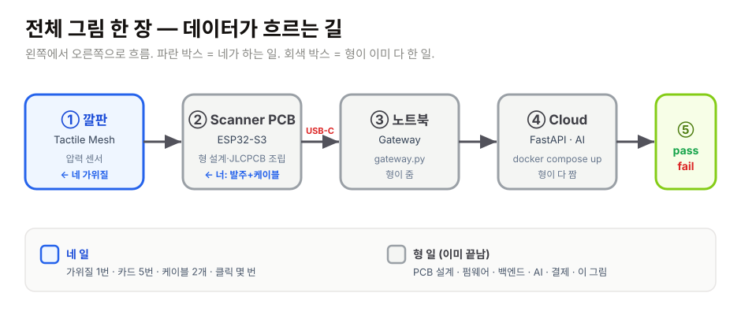

> 👆 **이 그림 한 장이 회사 전부임.** 파란색만 네가 함. 회색은 형이 끝냄. 아래 ASCII 는 같은 걸 글자로 그린 거니까 그림 봤으면 패스해도 됨.

```
                     ┌─────────────────────────────┐
                     │   고객 공장 컨베이어 벨트   │
                     └──────────────┬──────────────┘
                                    │
                  ─── HARDWARE ─────┴──── (← 네 일)
                                    │
              ┌─── Tactile Mesh ────┘
              │   (Velostat + 도전성 천 격자 + TPU)
              │                      ← 네가 가위질
              │
              ▼
       Scanner PCB
       (ESP32-S3-WROOM-1 + MUX × 2 + ADC + USB-C)
              │                      ← 형이 설계, JLCPCB 가 조립, 너는 발주
              │
              │  USB-C
              ▼
       Tactile Edge ── Jetson Orin Nano + edge_agent (형이 짠 데몬)
              │        ← 너: 조립 + JetPack + 에이전트 셋업
              │  HTTPS (네트워크)
              ▼
   ─── SOFTWARE ─────────────────────────── (← 형 일)
              │
       Tactile Cloud  ←── FastAPI 백엔드 (이 레포 `backend/`, 노트북/서버에서 docker)
              │
              ▼
       대시보드 / 슬랙 / MES
```

**네 일** = `HARDWARE` 박스 전부 + Edge 박스 조립·셋업 (단, PCB 설계와 edge_agent 는 형이 끝냈으니 너는 발주·조립·설정만).
**형 일** = `SOFTWARE` 전부 + PCB 설계 + edge_agent + 깔판 설계 + 결제 + 이 문서.
**둘 다 망하면 안 되는 거** = USB-C 케이블 빠지면 둘 다 망함. 데모 중엔 케이블에 테이프 한 조각 붙여서 고정해. 데모 망하는 거 90%가 케이블임.

> 💡 이 그림에서 깔판·PCB·Edge 박스(하드웨어 + 셋업)가 네 영역, edge_agent·Cloud·AI 가 형 영역. 어려운 SW 는 다 형이 했고, 너는 "물리적으로 만들고 꽂고 켜는" 일을 함.

> 🚀 **이번엔 Jetson Edge 산다 (예전 "사지 마" 뒤집음).** 연구비 여유 생겨서 노트북 야매 대신 진짜 추론 박스를 만든다. Jetson Orin Nano 8GB 가 위에서 `edge_agent` 돌리며 스캐너를 읽고 클라우드로 쏨 — 노트북이 하던 일을 이 박스가 대신함. 공장에 그대로 들고 갈 수 있는 물건이라, 데모 설득력이 다름.

---

## 2. 부품 쇼핑 리스트 — **이 표 그대로 카드 긁어라**

> ⚠️ **가격은 2026년 5월 기준** (1 USD ≈ ₩1,360). 시간 지나면 살짝 바뀜. 1~2천원 차이로 형한테 "표랑 가격 달라요" 톡 하지 마. 환율은 형이 통제 못 함.
> ⚠️ **링크는 끊어질 수 있음.** 끊어졌으면 부품명을 그대로 복사해서 같은 사이트 검색창에 붙여넣어. "링크 안 됨" 톡 보내지 마. 그냥 검색해. 검색창 = 사이트 위쪽에 돋보기 모양 있는 그 칸.
> 💡 한국 발주는 **디바이스마트** (다음날 도착), 해외는 **Adafruit** (5~10일, DHL). PCB 는 **JLCPCB** 풀턴키. 이 세 군데 + 쿠팡. 네 군데임. 외워둘 필요 없음. 아래 표마다 어디서 사는지 다 써놨음.

### 2.1 깔판 (Tactile Mesh) — **약 8만원**

| # | 부품 | 수량 | 어디서 | 단가 (대략) | 링크 / 검색어 |
|---|------|------|--------|-----------:|---------------|
| M1 | **Velostat / Linqstat 시트** (압력 감지 필름, A4 1장) | 1장 (280×280 mm) | Adafruit | $4.95 ≈ ₩6,800 | [Adafruit #1361](https://www.adafruit.com/product/1361) — 검색어: `Velostat 1361` |
| M2 | **전도성 천** (silver-plated nylon ripstop, 50 mΩ/sq, A4 정도) | 1장 | Adafruit | $19.95 ≈ ₩27,000 | [Adafruit #1167](https://www.adafruit.com/product/1167) — 검색어: `conductive fabric ripstop` |
| M3 | **전도성 실** (silver-plated 4-ply) | 1롤 | Adafruit | $6.95 ≈ ₩9,500 | [Adafruit #641](https://www.adafruit.com/product/641) — 검색어: `conductive thread 641` |
| M4 | **Kapton 테이프** (25 µm × 12 mm 폭 × 33 m) | 1롤 | 디바이스마트 / 쿠팡 | ₩6,000 ~ 12,000 | 디바이스마트 검색: `Kapton tape 12mm` |
| M5 | **TPU 라미네이팅 필름** (식품등급, A4 10장 묶음) | 1팩 | 쿠팡 | ₩8,000 ~ 15,000 | 쿠팡 검색: `라미네이팅 필름 A4 무광` (광택 NO, 무광 / 매트) |
| M6 | **3M VHB 5952 양면테이프** (25 mm × 33 m) | 1롤 | 쿠팡 | ₩28,000 | 쿠팡 검색: `3M VHB 5952` |
| M7 | **FFC 케이블** (1.0 mm pitch, 16-pin × 2개, 길이 150 mm) | 2개 | 디바이스마트 / 디지키 | ₩2,500 / 개 | 디바이스마트 검색: `FFC 1.0mm 16pin 150mm` (좌우 동일면) |

**소계: 약 8만원.** Adafruit 3개 (M1, M2, M3) 한 번에 시키면 배송비 절약. 한 번에 시켜. 따로 시키면 배송비 두 번 냄. 배송비가 부품값보다 비쌀 수도 있음.

> 💡 **"무광 / 매트" 가 왜 중요하냐 (M5)?** 광택 필름은 표면이 매끄러워서 압력 분포가 미끄러지고, 라미네이팅할 때 기포가 갇혀. 무광은 표면에 미세 요철이 있어서 잘 붙고 압력 전달이 안정적. 그냥 "무광" 사. 광택 사면 다시 사야 함.

> 💡 **개인통관고유부호 안 만들었으면 지금 발급해.** [unipass.customs.go.kr](https://unipass.customs.go.kr) 1분 컷. Adafruit 결제할 때 필요함. "P" 로 시작하는 13자리임. 이거 없으면 통관에서 박스가 인질로 잡힘. 지금 새 탭 열어서 발급받아. 진짜 1분임. 지금. 형이 기다려줄게. (못 기다림. 그냥 발급받아.)

### 2.2 Scanner PCB — **JLCPCB SMT 풀턴키, 5장 약 12만원**

> 형이 다 끝냄. 너는 클릭 4번이면 됨. ㅋ 진짜 클릭 4번임. 형이 KiCad 에서 핀 하나하나 배치하고, 임피던스 매칭하고, 4층 스택업 정의하고, DRC 돌리고 한 거를 너는 파일 3개 업로드로 받아먹는 거임. 양심 있으면 이 섹션 끝나고 형한테 커피 한 잔 사라.

#### 형이 준 것

```
hardware/pcb/conet-scanner-v1/
├── README.md           ← 보드 설명, 핀맵, 알려진 이슈 (형이 쓴 거)
├── schematic.md        ← schematic 의 markdown 표현 (사람이 읽을 수 있게)
├── gerbers.zip         ← JLCPCB 에 던지는 제조 파일 ⭐
├── bom.csv             ← JLCPCB 가 부품 사올 목록 ⭐
└── cpl.csv             ← JLCPCB 가 부품 어디 붙일지 좌표 ⭐
```

⭐ 표시된 파일 3개가 JLCPCB 에 업로드할 거임. 나머지 2개 (README, schematic) 는 너 읽으라고 있는 거임. 헷갈리지 마. 업로드는 3개. 읽는 건 2개.

> ⚠️ **현재 상태**: schematic.md 와 README.md 는 이 PR 에 같이 들어있음. `gerbers.zip`, `bom.csv`, `cpl.csv` 는 형이 EDA 툴 (KiCad / Altium) 작업해서 별도 PR 로 합류시킬 거임. 그 PR 머지되면 이 폴더가 완성됨. 그 전까지는 schematic.md 만 보면서 "아 이런 보드구나" 만 알면 됨. **즉, 지금 당장 JLCPCB 발주는 못 함.** 깔판 부품 (2.1) + 도구 (2.3) 먼저 발주하고, 깔판 만들면서 형이 Gerber PR 머지하길 기다려. 동시에 진행하면 시간 안 버림.

#### JLCPCB 발주 - 클릭 4번 (사실 클릭은 4번보다 많은데 어려운 건 4번임)

1. [jlcpcb.com](https://jlcpcb.com) → 우측 상단 **Sign up** → 이메일로 회원가입 (1분). 이메일 인증 메일 옴. 스팸함도 봐.
2. 로그인 후 → 상단 메뉴 **Order Now** (또는 "PCB Assembly" 큰 버튼) → **"Add Gerber file"** 버튼 클릭 → 파일 선택창 뜨면 `hardware/pcb/conet-scanner-v1/gerbers.zip` 선택해서 업로드. zip 그대로 올려. 압축 풀지 마.
3. 업로드되면 보드 미리보기가 화면에 뜸 (초록색 또는 네가 고른 색 보드 그림). 그 아래 옵션들 이렇게 설정:
   - Base Material: **FR-4**
   - Layers: **4** ← 이거 꼭 4. 기본값 2로 되어있을 수 있음. 꼭 4로 바꿔.
   - Dimensions: 자동 인식됨 (약 60 × 40 mm) — 손대지 마.
   - PCB Qty: **5** (5장이 가장 가성비, 더 비싸지 않음)
   - PCB Color: 검정 (간지) 또는 보라 (Conet 라임그린이랑 안 어울리지만 보라가 시그니처 PCB 색). 색은 성능이랑 무관함. 폼임. 형은 검정 추천.
   - Surface Finish: **ENIG (lead-free)** — 식품 라인 갈 거니까 필수. HASL 고르지 마. ENIG.
   - Outer Copper Weight: **1 oz**
   - Inner Copper Weight: **0.5 oz**
   - Via Covering: **Tented**
   - 나머지 옵션 (Remove Order Number, Castellated 등) 은 건드리지 마. 기본값.
4. 페이지 하단 또는 우측에 **"PCB Assembly"** 토글이 있음 → **ON** 으로 켜기 (= SMT 풀턴키, JLCPCB 가 부품 다 붙여줌). 켜면 옵션 더 나옴:
   - PCBA Type: **Standard**
   - Assembly Side: **Top Side** (보드 한쪽만, 우리 보드는 부품이 위쪽에만 있음)
   - Tooling Holes: **Added by JLCPCB**
   - Confirm Parts Placement: **Yes** (한 번 더 확인하겠다는 거. Yes 해. 1~2일 더 걸리지만 안전함.)
5. **Add BOM File**: `bom.csv` 업로드. (부품 목록)
6. **Add CPL File**: `cpl.csv` 업로드. (부품 좌표)
7. JLCPCB 시스템이 BOM 매칭 결과를 표로 보여줌. 초록 = 재고 있음, 빨강 = Out of Stock. **빨간 줄 나오면** → 그 줄의 **Alternative** (또는 "Choose a part") 클릭 → 형이 BOM 의 비고/주석 칸에 표시해놓은 대체 부품번호 (LCSC 번호, "C" 로 시작) 를 검색해서 골라. 형이 미리 1순위/2순위 부품 다 적어놨음. 그대로 따라가면 됨.
8. **Save to Cart** → **Checkout** → 배송지 (영문) + 개인통관고유부호 입력 + 배송 방법 **DHL Express** 선택.
9. 결제. 끝. **5장에 약 $80 ~ $90 (≈ ₩110,000)** + 배송비 $20 ≈ **합 ₩140,000**. (신규 쿠폰 받으면 더 쌈, 아래 3.4 참조.)

> 💡 **JLCPCB 가 부품도 다 사다가 다 붙여서 보내줌.** 너는 완성된 보드 5장을 박스로 받음. 인두질 안 해도 됨. 0402 부품 핀셋으로 집을 일 없음. 그냥 박스 까면 완제품. 8~10일 후 도착. 이게 풀턴키의 마법임. 형이 이 옵션 일부러 고른 거임 — 너 인두질 시키면 100% 보드 태워먹을 거 아니까.

#### PCB 도착 후 검사 (10분)

1. 박스 깔 때 SMD 부품 떨어뜨리지 말기. 보드는 ESD (정전기방지) 백 — 은색/분홍색 비닐 — 에 들어있음. 백 째로 꺼내서 매트 위에서 열어.
2. **육안 검사**: USB-C 커넥터 (옆구리 길쭉한 거), ESP32 모듈 (가운데 제일 큰 은색 사각형, 위에 안테나 패턴 있음), MUX 2개 (작은 검정 사각형 두 개) 가 다 붙어 있는지 눈으로 확인. 비뚤어지거나 빠진 거 없으면 OK.
3. **전원 검사**: USB-C 케이블 노트북에 꽂기. 보드의 빨간/녹색 LED 가 켜져야 함. LED 안 켜지면 = 보드 죽음 (드물지만 가능). 당황하지 말고 **다른 보드 시도.** 5장 받은 이유가 이거임. 5장 다 안 켜지면 그건 케이블 문제일 확률이 높음 (8.1 참조).
4. **시리얼 검사**: Arduino IDE 의 Tools → Port 에 보드가 잡혀야 함. (자세한 건 5절 참조)

> 💡 **5장 받는 이유**: 1장 데모용 + 1장 백업 + 1장 망가뜨릴 거 (너 100% 한 장은 어딘가 태우거나 케이블 잘못 꽂아서 못 쓰게 만듦, 형이 안다) + 2장 다음 고객 라인용. 미리 받아두면 마음 편함. 그리고 5장이나 10장이나 가격 거의 같음. 5장 시켜.

### 2.3 도구 (한 번만 사면 됨) — **약 12만원**

> SMT 조립은 JLCPCB 가 다 함. 너는 디버그/수리용 도구 + 깔판 만들 도구만 있으면 됨. 아래 7개. 회사 서랍에 굴러다니는 거 빼면 절반은 이미 있을 수도 있음.

| # | 도구 | 수량 | 어디서 | 단가 | 검색어 |
|---|------|------|--------|-----:|--------|
| T1 | **납땜 인두 키트** (60W 온도조절, 가위 떼면 끝, 와이어 인두용) | 1 | 쿠팡 | ₩30,000 | `납땜 인두 키트 온도조절` |
| T2 | **솔더 와이어** (0.5 mm 100g) | 1 | 쿠팡 | ₩8,000 | `솔더 0.5mm` |
| T3 | **디지털 멀티미터** | 1 | 쿠팡 | ₩15,000 | `디지털 멀티미터 DT-830B` |
| T4 | **로타리 커터** (45 mm + 자) | 1 | 쿠팡 | ₩10,000 | `로타리 커터 45mm` |
| T5 | **스테인리스 자 300 mm** (미끄럼방지) | 1 | 쿠팡 | ₩6,000 | `스테인리스 자 300mm` |
| T6 | **A3 라미네이팅 머신** (가정용) | 1 | 쿠팡 | ₩55,000 | `라미네이팅 머신 A3 가정용` |
| T7 | **정전기방지 작업매트** | 1 | 쿠팡 | ₩3,000 | `정전기방지 작업매트` |

**소계: 약 12만원.** 회사 서랍에 이미 있는 거 빼라. (인두 / 멀티미터 흔히 굴러다님.)

> 💡 **이미 갖고 있는 거 다 빼면 4~5만원 선까지 떨어짐.** 회사 책상 서랍 다 까봐. 그래도 라미네이터는 십중팔구 없음. 라미네이터 (T6) 가 제일 비싼데, 이건 깔판을 코팅해서 "양산품처럼" 보이게 하는 핵심 도구라 아끼지 마. 라미네이터 없이 테이프로 때우면 데모에서 "어 이거 학생 작품인가요?" 소리 들음.

> 💡 **T3 멀티미터 "DT-830B" 가 뭐냐?** 세상에서 제일 흔한 노란색 싸구려 멀티미터 모델명임. 이거면 충분함. 비싼 거 살 필요 전혀 없음. 저항만 잴 거니까. 노란색 1.5만원짜리. 그거.

### 2.4 Tactile Edge — **Jetson Orin Nano, 약 78만원** ★ 이번에 새로 추가

> 진짜 추론 박스. 노트북 야매 대신 공장에 들고 갈 "그 박스" 를 만든다. **개발자 키트(Developer Kit)** 사야 함 — 베어 모듈(SOM)만 사면 캐리어보드 따로 만들어야 해서 양산용임. 첫 대는 무조건 **Developer Kit.**

| # | 부품 | 수량 | 어디서 | 단가 (대략) | 검색어 / 메모 |
|---|------|------|--------|-----------:|---------------|
| E1 | **NVIDIA Jetson Orin Nano 8GB Developer Kit** | 1 | NVIDIA·Arrow·국내 총판 (디바이스마트/엘레파츠) | ₩680,000 ($499) | `Jetson Orin Nano Developer Kit` — **Super 키트면 그게 최신**, 그거 사 |
| E2 | **NVMe M.2 SSD 256GB** (2280) | 1 | 쿠팡 | ₩45,000 | `M.2 NVMe 256GB` — JetPack·프레임 버퍼 저장용. microSD만으론 느림 |
| E3 | **전원어댑터** (키트 동봉 안 됐으면) | 1 | 쿠팡/총판 | ₩20,000 | 공식 19V 어댑터 또는 **PD 45W+ USB-C**. 전력 모자라면 부팅 중 꺼짐 |
| E4 | **microSD 64GB** (초기 플래시/복구용) | 1 | 쿠팡 | ₩12,000 | `microSD 64GB UHS-I` — SSD에 OS 깔기 전 부팅용 |
| E5 | (옵션) **방열 케이스 / 쿨링팬** | 1 | 쿠팡/총판 | ₩25,000 | Dev Kit은 방열판 기본 있음. 케이스는 데모 폼용, 첫 대엔 생략 가능 |

**소계: 약 78만원** (E1~E4 필수, E5 옵션). DIN레일 함체·PoE·M12·릴레이 같은 "공장 설치" 부품은 **두 번째 라인부터** — 첫 대는 Dev Kit + SSD로 충분.

> 💡 **Jetson 은 어디서 사냐?** 국내 총판(디바이스마트·엘레파츠 등)에 재고 있으면 익일~2일, 없으면 NVIDIA/Arrow 수입으로 1~2주. **재고 있는 데서 사는 게 제일 빠름.** "Orin Nano 8GB Developer Kit" 로 검색해서 재고 ✅ 뜨는 데 골라. (4GB 말고 8GB. AI 모델 돌릴 거라 메모리 중요.)

> ⚠ **Orin Nano vs Orin NX vs Nano(구형)** 헷갈리지 마. 우리 건 **Orin Nano 8GB** (40 TOPS급). 그냥 "Orin Nano 8GB Developer Kit" 정확히 그 글자로 검색. 구형 "Jetson Nano"(2019) 사면 안 됨 — 그건 너무 약함.

### 2.5 Tactile Edge 디스플레이 — **터치 화면 + 케이스, 약 14만원** ★ 이번에 새로 추가

> 야 진짜 미친 거 인정한다. 우리가 한 달 전엔 ".dmg / .exe" 깔라고 했어 ㅋㅋㅋ 공장 박씨 아저씨한테. 그래서 이제부턴 **엣지박스에 화면을 박는다.** 어차피 현장에 놓을 거, 화면 같이 박으면 노트북 없이 조작 됨. Cognex In-Sight 처럼.
>
> 작동 방식: Jetson HDMI → 7" 또는 10" 터치 디스플레이. 부팅하면 **Chromium 키오스크 모드**로 `http://127.0.0.1:8088/kiosk/index.html` 자동 띄움. 그 페이지는 `edge_agent` 가 직접 서빙함 (외부 인터넷 필요 없음). 라미네이팅 끝난 깔판 위에 물건 올리면 화면에 verdict 가 뜸. **조작 = 손가락 터치.** 노트북 0대.

| # | 부품 | 수량 | 어디서 | 단가 (대략) | 검색어 / 메모 |
|---|------|------|--------|-----------:|---------------|
| D1 | **7" HDMI 터치 디스플레이 1024×600** | 1 | 디바이스마트 / 알리 / Waveshare | ₩85,000 ($65) | `Waveshare 7inch HDMI LCD (H) (with case)` 또는 `7인치 HDMI 터치 디스플레이 IPS`. **정전식(capacitive)**, USB 터치, IPS 패널 골라. 저항식(resistive) 사지 마 — 글로브 안 먹음. |
| D2 | (대안) **10.1" HDMI 터치 디스플레이 1280×800** | 1 | 디바이스마트 / Waveshare | ₩135,000 ($105) | 같은 시리즈에서 10.1형. 라인 옆에서 2m 떨어져서도 보고 싶으면 이게 나음. 7"는 작업자 1m 이내일 때 추천. |
| D3 | **HDMI Micro→Standard 케이블** 30cm | 1 | 쿠팡 / 디바이스마트 | ₩6,000 | Jetson Orin Nano 의 HDMI 포트는 **풀사이즈**, 디스플레이는 micro/mini 인 경우 많음. 디스플레이 스펙 보고 매칭해서 사. |
| D4 | **USB-A↔USB-Micro-B 케이블** 30cm | 1 | 쿠팡 | ₩3,000 | 디스플레이의 터치 신호를 Jetson 으로. 디스플레이 박스에 동봉되는 경우도 많음 — 박스 까보고 없으면 사. |
| D5 | **5V 3A USB 어댑터** + USB-A↔Micro-B 케이블 | 1 | 쿠팡 | ₩12,000 | 디스플레이 백라이트용. Jetson USB 포트에서 따도 되는데 전류 부족하면 화면 깜빡임 → 별도 어댑터 권장. |
| D6 | **VESA 75 마운트 암** 또는 **데스크 스탠드** | 1 | 쿠팡 | ₩30,000 | 컨베이어 옆에 디스플레이 띄울 거. VESA 75x75 마운트 홀 박힌 디스플레이 사야 함 (Waveshare 케이스 모델은 박혀 있음). 첫 대 데모는 그냥 책상 스탠드로도 OK. |

**소계: 약 14만원** (D1+D3+D4+D5+D6). D1 대신 D2 골라도 ₩4만원 차이.

> 💡 **왜 HDMI 인가, DSI 아닌가?** Raspberry Pi 라면 DSI 리본 한 줄로 끝나지만 Jetson Orin Nano 는 DSI 가 기본 비활성화 (디바이스 트리 수정 필요). HDMI는 켜자마자 됨. 첫 대는 HDMI 가 답. 양산 모드 가면 DSI / eDP 로 케이스 안에 통합.
>
> ⚠ **저항식 사지 마.** 저항식은 손가락 살짝 닿는 거 안 먹음. 공장에서 작업자가 면장갑 끼고 누르는데 저항식이면 누르는 힘 세팅 잘못 되면 안 눌림. 정전식(capacitive) 으로 사. 상세페이지에 "5-point capacitive" 또는 "정전식 멀티터치" 적혀 있으면 OK.

---

## 3. 발주 가이드 — **사이트별 한 페이지**

> 형은 발주 자동조종 모드인데 너는 처음일 수 있음. 이미 아는 데는 건너뛰어라. 모르면 한 줄씩 따라와. 형이 진짜 손잡고 알려줌. 그림부터 봐.

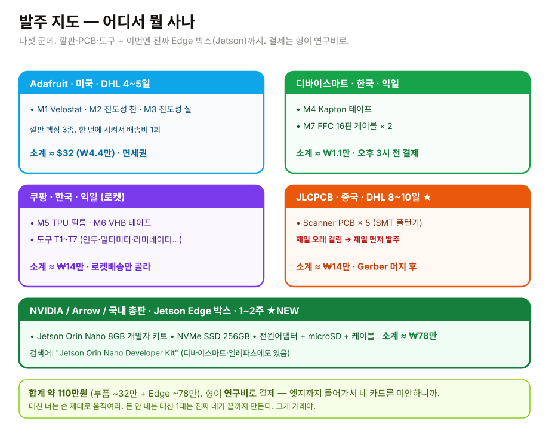

> 👆 **다섯 군데.** 어느 사이트에서 뭘 사는지 이 한 장에 다 있음. 색깔로 묶어놨으니 카드별 장바구니라고 생각하고 채워. 아래쪽 초록 박스가 이번에 추가된 Jetson Edge.

### 3.0 돈은 누가 내냐 — **이번엔 형이 낸다. 연구비로.** 💸

- 원래는 "부품값은 네가 내라" 였음. 근데 **엣지박스(Jetson)까지 들어가서 ~110만원** 되니까, 이걸 네 카드로 시키는 건 형이 좀 미안함. 그래서 **형이 연구비(지원금)로 결제한다.**
- 대신 조건: **돈 안 내는 만큼 손은 제대로 움직여라.** "1대는 네가 진짜 끝까지 만든다" — 발주·가위질·셋업·캘리브·데모까지. 그게 거래야. 돈도 안 내고 손도 안 움직이면 그건 그냥 구경꾼임.
- 실무: 발주는 **네가 하되, 결제 카드/계정은 형 거(또는 법인 연구비 카드) 쓰게 줄게.** 발주 직전에 형한테 "결제 단계까지 다 담았다" 톡 하면 형이 카드 정보 넣거나 승인함. 너는 장바구니까지 정확히 채워놓는 게 일.
- 그러니까 **3.1~3.7 따라서 다섯 군데 장바구니 다 채우고**, 결제 직전에 형 호출. 영수증·주문번호는 그래도 다 캡처 (연구비 증빙 필요함, 이건 진짜 빡셈).
- ⚠ 연구비 증빙은 국세청·기관 감사 들어옴. **주문내역/세금계산서/카드전표 빠짐없이 캡처해서 형한테 넘겨.** 이거 하나 빠지면 형이 소명자료 쓰느라 밤샘. 그건 진짜 민폐임.

### 3.0.1 발주 순서 — **오래 걸리는 것부터. 같은 날 다 질러.**

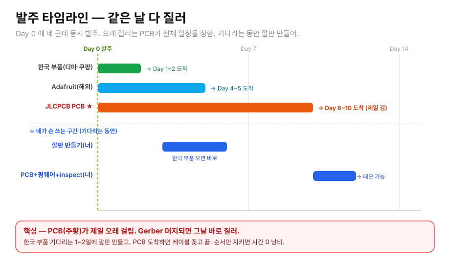

> 👆 **PCB(주황)가 제일 오래 걸림 = 전체 일정을 PCB가 정함.** 그러니까:
> 1. **Gerber PR 머지되면 그날 즉시 JLCPCB부터** 질러 (8~10일짜리라 제일 먼저).
> 2. 같은 날 Adafruit(4~5일) + **Jetson Edge(5~7일)** + 한국 부품(1~2일)도 다 질러. 한 번에 다섯 군데.
> 3. 한국 부품 오는 1~2일에 **깔판 만들기** (4절). Jetson 오면 **JetPack + edge_agent 셋업** (7절) — 둘 다 PCB 기다리는 동안.
> 4. PCB 도착 → 깔판·Jetson에 케이블 꽂고 → 펌웨어 → 캘리브 → 가동 → 데모. 순서만 지키면 노는 시간 0.
>
> 거꾸로 하나씩 받아서 하나씩 하면 배송 대기가 직렬로 쌓여서 5~6주 됨. **같은 날 다 질러놓고, 기다리는 시간에 만들 수 있는 거 다 만들어.** 병렬로.

### 3.1 디바이스마트 (devicemart.co.kr) — 한국, 다음날

> **여기서 살 거: M4 Kapton 테이프, M7 FFC 16핀 케이블 ×2. 합 약 1.1만원.** 제일 만만한 데니까 여기부터 워밍업.

1. [devicemart.co.kr](https://www.devicemart.co.kr/) → 우측 상단 **회원가입**. 회사 명의로 살 거면 **사업자 회원** (세금계산서 발급됨). 잘 모르면 일단 개인으로 사고 주문내역 캡처해서 증빙. 회원가입 1분.
2. 상단 **검색창(돋보기)** → 부품명 그대로 붙여넣기. 두 번 검색함:
   - `Kapton tape 12mm` → 25µm 두께, 12mm 폭짜리로. (폭 다른 거 떠도 12mm 골라.)
   - `FFC 1.0mm 16pin 150mm` → **"좌우 동일면(Type A)"** 인지 상세페이지에서 확인. 헷갈리면 동일면. **2개** 담아 (행용 1 + 열용 1).
3. 각각 **장바구니 담기** → 우측 상단 **장바구니** 들어가서 수량 확인 (Kapton 1, FFC 2) → **주문하기**.
4. 배송지 입력 → **신용카드** 결제. (네 카드. 3.0 참고.)
5. ⏰ **오후 3시 이전 결제 → 당일 출고 → 다음 영업일 도착.** 3시 넘으면 하루 밀림. 오전에 질러. 주말 끼면 월요일 출고.
6. 세금계산서: 사업자 회원이면 마이페이지에서 자동 발급. 개인이면 주문내역 화면 캡처.

> 💡 **여기서 막힐 만한 거**: FFC 케이블 "동일면/반대면(Type A/Type B)" 헷갈림. 모르겠으면 **동일면(Type A)** 사. 우리 보드 커넥터 기준임. 그래도 불안하면 사진 찍어서 형한테 (상세페이지 스샷). "FFC 뭐 사요" 만 보내지 말고 스샷.

### 3.2 쿠팡 — 한국, 다음날 (로켓배송)

> **여기서 살 거: M5 TPU 라미네이팅 필름, M6 3M VHB 양면테이프, 그리고 도구 T1~T7 전부. 합 약 14만원.** 제일 큰돈 나가는 데. 도구는 한 번만 사면 평생 씀.

1. 검색해서 그냥 담아. 모르면 부모님한테 물어봐. (농담 아님. 쿠팡은 진짜 누구나 함. 너도 됨.)
2. 검색어 그대로:
   - M5: `라미네이팅 필름 A4 무광` ← **무광/매트.** 광택 사지 마 (4.3 이유 있음).
   - M6: `3M VHB 5952` ← 정품. 짝퉁 양면테이프 사면 컨베이어에서 떨어짐.
   - T1 `납땜 인두 키트 온도조절`, T2 `솔더 0.5mm`, T3 `디지털 멀티미터 DT-830B`, T4 `로타리 커터 45mm`, T5 `스테인리스 자 300mm`, T6 `라미네이팅 머신 A3 가정용`, T7 `정전기방지 작업매트`.
3. ⚠ **반드시 "로켓배송"(파란 로켓) 마크 있는 것만.** 일반 판매자는 1주일 걸림. 우리 일정에 1주일은 사치. 로켓 없으면 다른 셀러로 바꿔.
4. **회사 서랍 먼저 까봐.** 인두·멀티미터·자는 회사에 굴러다닐 확률 높음. 있으면 그건 빼. 도구 다 빼면 4~5만원까지 떨어짐. (그래도 라미네이터(T6)는 십중팔구 없음 — 이건 사야 함.)
5. 회사 카드로 긁고 주문내역 캡처. 지출증빙 모아서 정산.

> 💡 **도구는 "회사 자산"임.** 다음 깔판, 다음 보드 만들 때 또 씀. 1회성 지출 아님. 그러니 너무 싼 거 사서 인두 끝 금방 타는 거 사지 마. 중간 거.

### 3.3 Adafruit (adafruit.com) — 미국, DHL 4~5일

> **여기서 살 거: M1 Velostat, M2 전도성 천, M3 전도성 실. 합 약 $32 ≈ 4.4만원.** 깔판의 핵심 3종. 셋 다 한 번에 시켜서 배송비 한 번만 내.

1. [adafruit.com](https://www.adafruit.com/) → 우측 상단 **Account → Sign in → Create account** (이메일로).
2. 검색창에 **부품 번호** 그대로: `1361`(Velostat), `1167`(전도성 천), `641`(전도성 실). 번호로 치면 딱 그거 나옴. 이름으로 치면 비슷한 거 잔뜩 떠서 헷갈림. 번호로 쳐.
3. 셋 다 **Add to Cart** → 우측 위 **Cart** → **Checkout**.
4. 배송지(영문). 형 예시 형식 그대로, 네 정보로 바꿔서:
   ```
   Name: Gildong Hong
   Address Line 1: 123-45 Teheran-ro, Gangnam-gu
   Address Line 2: 7F Conet Studio
   City: Seoul
   State/Province: Seoul
   Postal Code: 06234
   Country: South Korea
   Phone: +82-10-1234-5678
   ```
5. 배송 방법: **DHL Express** ($55 정도) ← 무조건 이거. 4~5일 도착. USPS/이코노미 같은 싼 거 고르면 **2~3주** 걸리고 통관에서 더 잘 잡힘. 우리한텐 시간이 돈이라 DHL이 결국 더 쌈.
6. **개인통관고유부호(PCCC) 필수.** "P" 로 시작하는 13자리. 없으면 [unipass.customs.go.kr](https://unipass.customs.go.kr) 에서 1분 발급. 결제 단계 또는 배송정보 칸에 입력란 있음 — 비우고 넘어가면 통관에서 박스 인질로 잡힘.
7. 결제 (VISA / Master, 네 카드).
8. 💡 **면세 룰: 미국발 개인 직구는 합산 $150 이하면 관·부가세 면제.** 우리 3종 합 ~$32 라서 안전하게 면세권. **단, "장바구니 김에 이것도~" 하고 막 담아서 $150 넘기면 통관 때 세금+수수료 맞음.** 표(2.1)에 있는 M1·M2·M3 셋만 사. 욕심내지 마.

> 💡 **여기서 막힐 만한 거**: 통관고유부호 안 만들어서 결제 막힘 / DHL 말고 싼 배송 골라서 2주 날림. 둘 다 위에서 막아놨음. 위에서 시킨 대로만.

### 3.4 JLCPCB (jlcpcb.com) — 중국, DHL 8~10일 ⭐

> **여기서 살 거: Scanner PCB ×5 (SMT 풀턴키). 합 약 14만원.** 발주 중 제일 중요하고 제일 오래 걸림. **Gerber PR 머지되면 그날 바로.** 2.2 섹션에 클릭 순서 사진처럼 다 적어놨으니 그거랑 같이 봐. 여기선 핵심만 다시 짚음.

1. [jlcpcb.com](https://jlcpcb.com) → **Sign up** (이메일 인증, 스팸함도 봐) → 상단 **Order Now**.
2. **"Add Gerber file"** → `hardware/pcb/conet-scanner-v1/gerbers.zip` 업로드 (zip 그대로, 압축 풀지 마). 보드 미리보기 뜸.
   - ⚠ Gerber 파일은 형이 **별도 PR** 로 합류시킴. 그 PR 머지 전엔 이 단계 자체를 못 함. 머지됐는지 형한테 확인하고 들어와.
3. 옵션 (기본값에서 바꿀 것만): **Layers = 4** (기본 2로 돼있을 수 있음, 꼭 4!), **Surface Finish = ENIG**, **PCB Qty = 5**, 색은 검정 추천. 나머지(Outer 1oz / Inner 0.5oz / Via Tented)는 2.2 표대로.
4. **PCB Assembly 토글 ON** → **Standard / Top Side / Confirm Parts Placement = Yes.**
5. **Add BOM File** = `bom.csv`, **Add CPL File** = `cpl.csv`.
6. BOM 매칭 표 뜸. **빨간 줄(Out of Stock)** 나오면 → 그 줄 **Alternative** 클릭 → 형이 BOM 주석에 적어둔 대체 LCSC 번호("C…") 골라. 1·2순위 다 적혀 있음.
7. **Save to Cart → Checkout** → 배송지(영문) + 통관고유부호 + **DHL Express** → 결제.
8. 진행 추적: "My Orders" 에서 **Production → Quality Check → Shipped** 순서로 넘어감. ⚠ **매일 새로고침 100번 하지 마.** 하루 한 번. 형이 너 새로고침 중독 될 거 안다. 8~10일 걸리는 거 정상임.

> 💡 **신규 쿠폰 받아먹어**: 회원가입 직후 $30 정도 + 무료배송 쿠폰 자동 지급. 결제 직전 "available coupons" 뜨면 제일 큰 거 적용. 공돈이고, 이건 회사 돈 아끼는 거니까 형이 칭찬함.

> 💡 **왜 5장?** 1 데모 + 1 백업 + 1 네가 태워먹을 거 + 2 다음 고객. 5장이나 10장이나 값 거의 같음. 5장 질러. (3장 시켜놓고 "한 장 망가졌는데요" 톡 하지 마.)

### 3.4-b Jetson Edge 발주 (NVIDIA / Arrow / 국내 총판) — ★NEW

> **여기서 살 거: E1 Jetson Orin Nano 8GB Developer Kit + E2 NVMe SSD + E3 전원 + E4 microSD. 합 약 78만원.** 제일 비싼 발주라 정신 차리고. (그래도 형이 결제하니 너는 정확히 담기만.)

1. **재고 먼저 찾기.** 국내 총판(디바이스마트·엘레파츠 등) 검색창에 `Jetson Orin Nano Developer Kit` → 재고 ✅ 있으면 거기서 (익일~2일). 없으면 NVIDIA 공식/Arrow (수입 1~2주).
2. ⚠ **정확한 모델 확인**: **Orin Nano 8GB Developer Kit** (또는 그 "Super" 키트 = 최신 리비전). 4GB 아님, 구형 "Jetson Nano" 아님, "Orin NX" 아님. 글자 그대로 검색.
3. E2 NVMe SSD(256GB, 2280) + E4 microSD(64GB)는 쿠팡 로켓으로 같이. E3 전원은 키트에 동봉됐는지 상세페이지 확인 — 없으면 공식 19V 어댑터 또는 PD 45W+ USB-C.
4. 장바구니까지 담고 **결제 직전 형 호출** (연구비 카드). "Jetson 키트 + SSD + 전원 다 담았다, 결제 ㄱ?" 하고 톡.
5. 받으면 박스 안 구성품 확인 (보드·방열판·안테나·있으면 전원). 사진 찍어둬 (증빙 + 형 확인용).

> 💡 **왜 Dev Kit?** 베어 모듈(SOM)만 사면 캐리어보드를 따로 설계·제작해야 함 = 양산 단계 일임. Dev Kit은 캐리어보드+포트+방열판이 다 붙어 나와서 박스에서 꺼내 바로 켬. 첫 대는 무조건 Dev Kit.

### 3.5 통관 1분 가이드 — 해외 발주(Adafruit·JLCPCB) 전용

해외 박스가 안 오는 거 90%는 통관임. 미리 막자.

1. **개인통관고유부호(PCCC) 발급** — [unipass.customs.go.kr](https://unipass.customs.go.kr) → 공동인증서/간편인증 로그인 → 1분. "P" + 숫자 12자리. 한 번 만들면 평생 씀.
2. 발급한 번호를 **Adafruit·JLCPCB 결제 시 배송정보 칸에 그대로 입력.** 비우면 막힘.
3. 박스 뜨면 **DHL에서 문자/메일 옴.** 통관 서류 요청이면 무시하지 말고 바로 응답. (캡처해서 형한테 공유해도 됨.)
4. 면세 한도: 미국발 합산 **$150 이하 면제.** 우리 Adafruit 주문은 ~$32라 안전. JLCPCB는 관세 대상일 수 있는데 청구서 결제하면 풀림 (배송비 포함해도 소액).
5. 막히면: 통관고유부호 누락이 1순위, 주소 오타가 2순위. 둘 다 위에서 막아놨음.

### 3.6 발주 체크리스트 — 한 칸씩 체크

- [ ] **3.0 읽음** — 이번엔 형이 연구비로 낸다, 대신 나는 손 끝까지 움직인다. 💸
- [ ] 개인통관고유부호 발급 (해외 발주 전에!)
- [ ] **디바이스마트**: M4 Kapton, M7 FFC ×2 (오후 3시 전)
- [ ] **쿠팡**: M5 무광필름, M6 VHB, 도구 T1~T7 (로켓배송만). 서랍에 있는 도구는 뺌
- [ ] **Adafruit**: M1·M2·M3 한 번에, DHL Express, 통관번호 입력, $150 안 넘김
- [ ] **JLCPCB**: Gerber PR 머지 확인 → PCB ×5 풀턴키, 4-layer/ENIG, BOM·CPL 업로드, 쿠폰 적용
- [ ] **Jetson Edge**: Orin Nano **8GB** Developer Kit + NVMe SSD + 전원 + microSD. 재고 있는 데서
- [ ] 다섯 군데 다 **장바구니까지 채우고 → 결제 직전 형 호출** (연구비 카드)
- [ ] 모든 영문 배송 주소 오타 없음
- [ ] 모든 결제 **주문내역·세금계산서·카드전표 캡처** (연구비 증빙, 빠짐없이!)
- [ ] 각 사이트 **도착 예정일 캘린더에 박음** (안 박으면 까먹고 "왜 안 와요" 톡 함)
- [ ] **결제 후 형한테 톡** (형식 지켜):
  > "발주 완료. 디마(M4,M7) 내일 / 쿠팡(M5,M6,도구) 내일 / Adafruit(M1~M3) ~Day5 / Jetson(Edge키트) ~Day7 / JLCPCB(PCB×5) ~Day10. 증빙 다 캡처해서 넘김."
  - "발주했음" 세 글자만 보내면 형이 못 알아봐. **뭘 + 어디서 + 언제 도착** 다 적어. 이게 평생 패턴임. 항상 "뭘 + 언제".

---

## 4. 조립 — **드디어 너 손 움직일 시간**

> ⏱️ **총 시간**: 깔판 1.5시간 + PCB 케이블 연결 5분 + 라미네이팅 30분 = **약 2시간**. 처음 하면 3시간. 괜찮음. 두 번째 깔판은 1시간 컷.
> 🩹 **안전**: 인두 350°C, 손 대지 마. 환기. 라미네이터도 뜨거움. 뜨거운 건 다 만지지 마. 너 손이 회사 자산임.

### 4.1 깔판 만들기 — 16 × 16 = 256 셀

> 원리부터. 안 읽고 손부터 대면 비뚤어진 깔판 나옴. **Velostat** (압력 받으면 저항이 떨어지는 검정 필름) 을 가운데 두고 위·아래로 **전도성 천 격자**. 가로줄 1개 (행) + 세로줄 1개 (열) 의 교차점이 한 셀. **16 × 16 = 256 셀**. PCB 의 ESP32 가 1초에 200번씩 256 셀을 다 훑어서, 어디가 눌렸는지 압력 지도를 만듦. 이 압력 지도가 "손바닥으로 만져본 느낌" 이고, 그걸 AI 가 보고 불량을 잡는 거임. 즉 이 깔판이 우리 회사의 "손" 임. 잘 만들어.

```
┌─ Top TPU 코팅 ───────────────────────────────────────┐
│ ─── 열 1 ───  ─── 열 2 ───  ───  ...  ─── 열 16 ─── │  ← 세로줄 (전도성 천 16가닥)
├──────────────────────────────────────────────────────┤
│   ░░░░░░░░░░ Velostat 압력 필름 ░░░░░░░░░░░░░░░░░░  │  ← 압력으로 저항이 변하는 검정 필름
├──────────────────────────────────────────────────────┤
│ ─── 행 1 ───────────────────────────────────────────  │
│ ─── 행 2 ───────────────────────────────────────────  │  ← 가로줄 (전도성 천 16가닥)
│   ...                                                │
│ ─── 행 16 ──────────────────────────────────────────  │
├──────────────────────────────────────────────────────┤
│              Bottom TPU 코팅                          │
└──────────────────────────────────────────────────────┘
```

위에서부터 빵처럼 쌓는 구조임: TPU(뚜껑) → 세로줄 천 16개 → Velostat → 가로줄 천 16개 → TPU(바닥). 샌드위치라고 생각해. Velostat 이 햄, 천 격자가 빵, TPU 가 포장지.

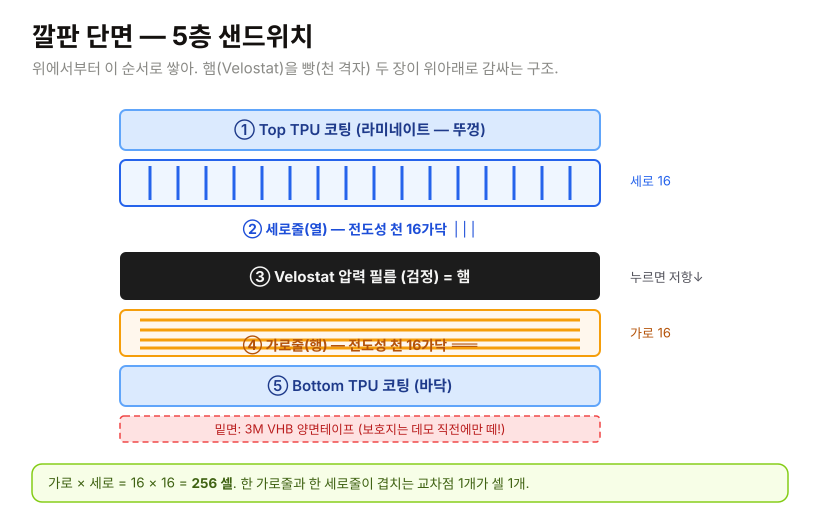

> 👆 **이 순서 그대로 쌓아.** ①번이 맨 위, ⑤번이 맨 아래. 검정(Velostat)이 가운데 햄. 위아래 천이 검정을 안 뚫고 닿으면 안 됨 (그래서 Velostat 이 가운데서 분리).

#### 단계별 (한 단계도 건너뛰지 마)

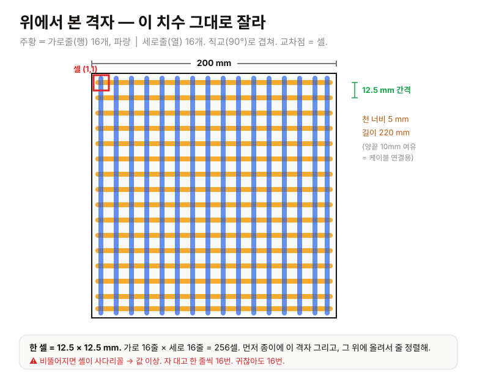

> 👆 **이 치수 그대로.** 종이에 이 격자부터 그리고, 그 위에 깔판 재료 올려서 선 맞춰. 주황 가로 16줄, 파랑 세로 16줄, 간격 12.5mm. 끝.

1. **종이에 격자 그려라.** A4 한 장에 200 × 200 mm 정사각형 그리고, 그 안에 12.5 mm 간격으로 가로선 16개 + 세로선 16개. 자 + 연필. **진짜로 그려라.** 이게 네 작업 도면이자 정렬 가이드임. "머릿속으로 하면 되겠지" → 비뚤어짐 → 셀이 사다리꼴 → ADC 값 이상 → 처음부터 다시. 그릴 시간 15분 vs 다시 만들 시간 1.5시간. 그려.
2. **Velostat 자르기**: 로타리 커터(T4) + 스테인리스 자(T5) → 200 × 200 mm 정사각 한 장. 자를 꾹 누르고 커터를 자에 바짝 붙여서 한 번에 쭉. 톱질하지 마. 한 방향으로 쭉.
   - 💡 Velostat 한 장으로 두 장 만들지 마. 처음엔 한 장에 한 라인. 욕심내다 둘 다 망침.
3. **전도성 천(M2)을 가로줄로 자르기**: 너비 **5 mm**, 길이 **220 mm** (양 끝 10mm 씩 케이블 연결용 여유). **16 가닥.** 자로 재고 표시하고 잘라. 5mm 너비 일정하게. 들쭉날쭉하면 셀 면적이 달라져서 캘리브레이션이 힘들어짐.
   - 💡 천이 잘 풀어짐 (올이 나감). 끝단에 **투명 매니큐어** 발라서 굳히면 안 풀림. 진짜로. 매니큐어 없으면 순간접착제 살짝. 끝단만. 가운데 바르면 전도 안 됨.
4. **Velostat 한쪽 면에 가로줄 16개 평행하게 깔기**: 줄 간격 **12.5 mm** (네가 그린 도면 위에 Velostat 올리고 비치는 선 따라 정렬). Kapton 테이프(M4)로 양 끝단만 임시 고정.
   - 💡 자를 대고 정렬해. 비뚤어지면 셀이 사다리꼴 됨. 한 줄 깔 때마다 도면 선이랑 맞는지 확인. 16번. 귀찮아도 16번.
5. **Velostat 위에 한 장 더 (또는 같은 한 장을 접어서)** 덮기. 가로줄과 세로줄이 직접 닿으면 안 되니까 Velostat 이 가운데서 둘을 분리하는 역할.
6. **세로줄 16개**: 같은 방식으로 위층에 12.5 mm 간격, 가로줄과 **직교** (90도). 가로줄이 ─ 방향이면 세로줄은 │ 방향. 격자 모양 나오면 정상.
7. **각 줄 끝단을 FFC 압착 또는 클립으로 PCB 에 연결할 준비**:
   - **방법 A (간단, 첫 1대 추천)**: 점퍼와이어 + 악어클립으로 16가닥 행 + 16가닥 열을 PCB 의 FFC 커넥터 핀에 일대일로 물림. 처음 1대는 무조건 이렇게. 빠르고 디버그 쉬움.
   - **방법 B (양산스러움)**: 도전성 접착제로 0.5 mm pitch FFC 케이블에 본딩. 양산은 ZIF 커넥터 + 전용 압착기. **첫 대에선 하지 마.** 어려움. 방법 A로 해.
8. **TPU 라미네이팅 필름(M5)** 위·아래 한 장씩 올림 (아직 라미네이터에 넣지 말고 멀티미터 검사 먼저! 아래 참조).
9. **밑면에 3M VHB 양면테이프(M6)** (컨베이어 부착용; 데모 시엔 책상에 깔아도 됨). **보호지는 절대 떼지 마.** 데모 직전에만 떼. 미리 떼면 먼지 다 붙어서 접착력 사망.

#### 라미네이팅 전 멀티미터 검사 — **반드시. 진짜 반드시. 별 백 개.**

라미네이팅하면 코팅이 덮여서 **못 고침.** 무조건 검사 먼저. 이 검사 안 하고 라미네이팅했다가 "안 됨" 톡 보내면 형이 제일 화남. 왜냐면 이 줄을 형이 굵은 글씨로 써놨거든.

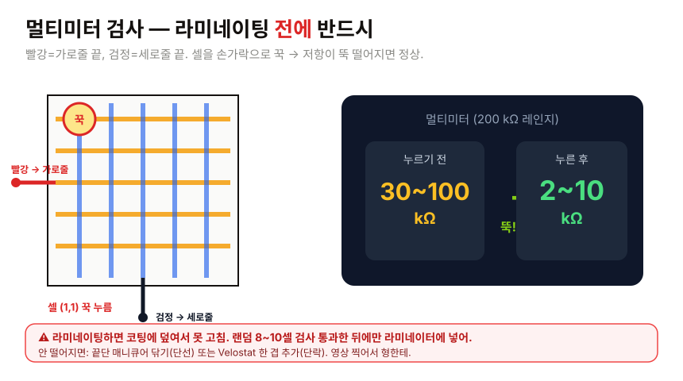

> 👆 **빨강=가로, 검정=세로, 손가락은 그 교차점.** 숫자가 큰 값에서 작은 값으로 뚝 떨어지면 정상. 안 떨어지면 아래 4번 참고.

1. 멀티미터(T3) 다이얼을 → 저항 (Ω 기호) → **200 kΩ** 레인지에 맞춰.
2. 빨강 프로브 → 가로줄 1번 끝단에 대기. 검정 프로브 → 세로줄 1번 끝단에 대기. (즉 셀 (1,1) 측정)
3. 다른 손가락으로 셀 (1,1) 위치 (가로1·세로1 교차점) 를 꾹 눌러.
   - **누르기 전**: 화면에 30 ~ 100 kΩ 정도 (또는 "1" 만 떠서 무한대 = 열린 상태일 수도, 그것도 정상)
   - **누른 후**: 2 ~ 10 kΩ 으로 **뚝 떨어져야** 함
4. 누르면 저항이 떨어지면 → **정상.** 박수. 안 떨어지면 (값이 그대로면):
   - 격자 단선 (천 줄이 끊겼거나 매니큐어가 끝단까지 와서 접점을 막음) → 끝단 매니큐어 닦고 다시
   - 위·아래 도전층이 직접 닿음 (단락, Velostat 을 뚫고 닿음) → Velostat 한 겹 더 추가
5. 랜덤으로 **8~10셀** 검사 (예: (1,1), (4,4), (8,8), (16,16), 모서리 몇 개). 256셀 다 안 해도 됨. 8~10개 다 정상이면 통과.

> 💡 이 검사를 **영상으로 찍어서 형한테 보내.** 손가락 누를 때 멀티미터 숫자 뚝 떨어지는 거. 형이 이거 보면 "오 진짜 만들었네" 하고 안심함. 그리고 이게 깔판 동작 증거라서 나중에 문제 생겨도 "그때는 됐었다" 는 기록이 됨.

### 4.2 PCB 도착 후 — **케이블 2개 꽂으면 끝**

JLCPCB 가 완성품을 보내줌. 너는 딱 2개 꽂으면 됨:

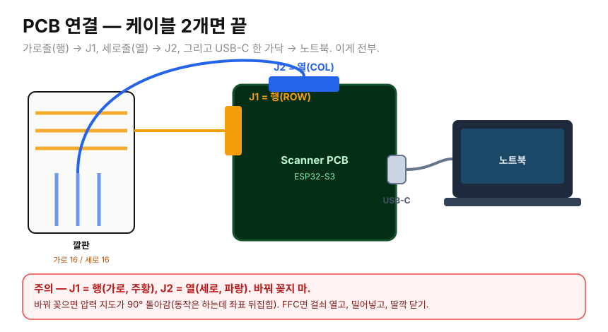

> 👆 **주황은 J1, 파랑은 J2, 그리고 USB-C 한 가닥 Jetson에.** 색만 맞춰 꽂으면 됨. 주황(가로) → J1, 파랑(세로) → J2.

1. **깔판 ↔ PCB**: 깔판의 가로줄 16가닥 → PCB 의 **J1 (ROW)** 16핀 FFC 커넥터. 세로줄 16가닥 → **J2 (COL)** 16핀 FFC 커넥터.
   - FFC 케이블이면 커넥터 걸쇠 (까만 작은 레버) 살짝 열고 케이블 밀어넣고 걸쇠 닫음. 딸깍.
   - 점퍼 + 클립이면 핀 번호 따라 1:1 으로 물림. (PCB 의 핀 번호는 보드 위 흰색 글씨 = silkscreen 에 인쇄돼 있음. J1-1, J1-2 ... 이런 식.)
   - ⚠️ **J1 과 J2 헷갈리지 마.** 행이 J1, 열이 J2. 바꿔 꽂으면 압력 지도가 90도 돌아간 채로 나옴 (동작은 함, 근데 좌표가 뒤집힘). 데모엔 문제없지만 헷갈리니까 맞춰 꽂아.
2. **PCB ↔ Jetson Edge**: USB-C 케이블 한 가닥. **이번엔 노트북 아니라 Jetson 에 꽂음.** Jetson에서 `/dev/ttyACM0` 로 잡힘 (7절에서 확인). 펌웨어 처음 구울 때만 노트북에 잠깐 꽂고, 그 뒤로는 쭉 Jetson.

> 💡 핀맵 / 회로 / 알려진 이슈 → `hardware/pcb/conet-scanner-v1/README.md` 참고. 형이 핀 하나하나 다 적어놨음. 헷갈리면 거기 봐. 거기 없으면 형한테 톡 (사진이랑 같이).

### 4.3 라미네이팅 (30분)

멀티미터 검사 통과했지? 안 했으면 위로 올라가. 했으면 진행.

1. 깔판 위·아래에 TPU 필름(M5) 한 장씩 덮어. 깔판이 필름 사이에 들어가게.
2. 라미네이터(T6) 전원 켜고 예열 (3~5분). 대부분 "준비 완료" LED 가 초록으로 바뀜.
3. **천천히** 통과시켜 (빠르면 기포 생김). 일정한 속도로 쭉. 손으로 당기지 말고 기계가 먹는 대로 둬.
4. 나온 거 식힌 뒤 (1분) 가장자리 삐져나온 필름을 가위로 다듬어. 깔끔하게.
5. 끝. 양산품처럼 반들반들한 깔판 완성. 폼 남.

> ⚠️ 라미네이터 온도 **110°C 권장.** 140°C 넘으면 Velostat 손상됨 (성능 떨어짐). 가정용 라미네이터는 보통 100~110°C 라 괜찮은데, 온도 설정 있는 모델이면 낮은 쪽으로. "핫" 말고 "쿨/저온" 모드 있으면 그거.

---

## 5. 펌웨어 굽기 — Arduino IDE 로 PCB 의 ESP32-S3 굽는 법

> "굽는다" = 코드를 칩에 써넣는다는 뜻. 빵 굽는 거 아님. 무서워하지 마. 버튼 두 개 누르면 됨.

### 5.1 Arduino IDE 설치 (15분, 1회)

1. [arduino.cc/en/software](https://www.arduino.cc/en/software) → 네 OS (Windows/Mac) 에 맞는 거 다운로드 → 설치. 그냥 Next Next Next.
2. IDE 열고 → **File → Preferences** → 아래쪽 **"Additional Boards Manager URLs"** 칸에 이거 붙여넣기:
   ```
   https://raw.githubusercontent.com/espressif/arduino-esp32/gh-pages/package_esp32_index.json
   ```
   (이미 다른 URL 있으면 쉼표 없이 줄바꿈으로 추가. 칸 오른쪽 작은 아이콘 누르면 여러 줄 입력창 뜸.)
3. **Tools → Board → Boards Manager** → 검색창에 `esp32` → **"esp32 by Espressif Systems"** 찾아서 **Install** (1~3분 걸림, 인터넷 속도에 따라).
4. **Tools → Board → esp32 →** 목록에서 **"ESP32S3 Dev Module"** 선택.
5. **Tools → USB CDC On Boot → Enabled** ⚠️ **이거 안 켜면 USB 시리얼 데이터 안 나옴.** 제일 많이 까먹는 거임. 형이 빨간 경고 박은 이유 = 너 까먹을 거 알아서. 켜.
6. **Tools → Port** → 보드 꽂은 포트 선택. (보드 안 꽂혀있으면 포트 안 보임. 먼저 꽂아.)

### 5.2 펌웨어 굽기 (10분)

```bash
git clone https://github.com/gkjuwon-tech/hw.git
cd hw/firmware/tactile_scanner_esp32/
```

1. Arduino IDE 에서 **File → Open** → `tactile_scanner_esp32.ino` 열기.
2. 좌측 상단 **✓ (체크 표시)** 버튼 = 컴파일 (Verify). 처음 30초~1분. 아래 콘솔에 "Done compiling" 뜨면 성공. 빨간 에러 뜨면 8절 또는 형한테 톡.
3. 좌측 상단 **→ (오른쪽 화살표)** 버튼 = 업로드 (Upload). 1분 정도. 끝나면 콘솔에 "Hard resetting" 뜨고 보드의 LED 가 깜빡임.

> 💡 PCB 의 핀맵은 펌웨어 (`tactile_scanner_esp32.ino`) 의 핀 정의와 **완전 일치**하게 형이 설계함. 너는 핀 번호 건드릴 필요 전혀 없음. 코드 한 줄도 수정하지 마. 그냥 열고 → 체크 → 화살표. 세 동작. 코드 수정하면 그때부터 형도 너 못 도와줌.

> ⚠️ 업로드 실패하면 ("Failed to connect" 등) → 8.1 표 참조. 대부분 BOOT 버튼 누른 채로 업로드하면 됨.

### 5.3 USB 시리얼 확인 (5분)

펌웨어가 200 Hz 로 256 byte + 헤더를 USB CDC 로 토하고 있어야 함. 아래 스크립트로 확인:

```bash
pip install pyserial
python3 - <<'EOF'
import serial, struct, sys
PORT = "/dev/tty.usbserial-XXX"   # ← Windows 면 COM3 같은 거. 너 포트 확인 후 바꿔.
BAUD = 2_000_000
HEADER = struct.Struct("<IHHIIHH")
MAGIC = 0x434F4E54
def read(s,n):
    b=b""
    while len(b)<n:
        c=s.read(n-len(b))
        if not c: sys.exit("port closed")
        b+=c
    return b
with serial.Serial(PORT, BAUD, timeout=1) as s:
    while True:
        x=read(s,1)
        if x!=b"T": continue
        rest=read(s,HEADER.size-1)
        m,r,c,seq,ts,crc,_=HEADER.unpack(x+rest)
        if m!=MAGIC: continue
        frame=read(s,r*c)
        print(f"seq={seq} avg={sum(frame)/len(frame):.1f}")
EOF
```

- `PORT` 만 네 포트로 바꿔. Mac 은 `/dev/tty.usbserial-...` 또는 `/dev/tty.usbmodem...`, Windows 는 `COM3` 같은 거. (Arduino IDE 의 Tools → Port 에서 본 그 이름 그대로.)
- 실행하면 `seq=... avg=...` 가 좌르륵 올라옴.
- **깔판 누를 때 `avg` 값이 올라가야 함.** 안 누르면 낮고, 누르면 높아짐. 손으로 깔판 꾹 누르면서 숫자 보는 거임. 숫자 올라가면 → 하드웨어 끝. 너 진짜 센서 만든 거임. 축하.
- 안 올라가면 → 깔판 ↔ PCB 배선 (4.2) 또는 깔판 자체 (4.1 멀티미터 검사) 문제. 8.2 참조.

> 💡 여기까지 왔으면 너 진짜 절반 이상 온 거임. 센서 만들고, 보드 굽고, 데이터 나오는 거 확인. 남은 건 백엔드 띄우고 연결하는 건데 그건 명령어 복붙임. 거의 다 왔어.

---

## 6. 백엔드 띄우기 — `docker compose up` 한 줄

### 6.1 사전 준비 (5분)

1. **Docker Desktop**: [docker.com/products/docker-desktop/](https://www.docker.com/products/docker-desktop/) 다운로드 → 설치 → 실행. 설치 후 한 번 켜둬야 함 (고래 아이콘이 위쪽 메뉴바/트레이에 떠 있어야 함). 안 켜고 명령어 치면 "Cannot connect to Docker daemon" 뜸. 고래 떠 있는지 확인.
2. **Git**: [git-scm.com](https://git-scm.com) (이미 5.2 에서 git clone 했으면 깔려 있는 거임. 그럼 패스.)

### 6.2 띄우기 (5분)

```bash
git clone https://github.com/gkjuwon-tech/hw.git   # 이미 했으면 생략
cd hw/backend
docker compose up --build
```

빌드 1~3분 (처음만 오래 걸림, 이미지 받아옴). 끝나면 터미널에 로그 좌르륵 뜨고 멈추지 않고 계속 켜져 있음 (정상임, 끄지 마, 서버가 돌고 있는 거임). 브라우저에서:

- API: http://localhost:8000
- 문서: http://localhost:8000/docs ← 여기 들어가면 모든 API 가 버튼으로 보임. 신기하지? 형이 만든 거임.
- 메트릭: http://localhost:8000/metrics
- 헬스: http://localhost:8000/healthz

> 💡 서버 끄려면 그 터미널에서 **Ctrl+C.** 다시 켜려면 같은 `docker compose up`. 작업 중엔 켜둔 채로 **새 터미널 창** 열어서 다음 단계 진행해.

### 6.3 첫 호출 (1분)

새 터미널에서:

```bash
curl http://localhost:8000/healthz
# → {"status":"ok","version":"0.1.0","environment":"production"}

curl http://localhost:8000/v1/pricing/catalog
# → {"belt_widths":[...], "edge_appliance_krw":1690000, "cloud_tiers":[...]}
```

이게 나오면 백엔드 끝. 형이 한 일임. 고마워해라. (진심으로 고마워하라는 거 아니고 그냥 한 번 "형 고생했네" 정도. 형도 사람임.)

### 6.4 Edge 가 쓸 API 키 발급 (2분) — **7절 전에 미리**

Jetson 의 `edge_agent` 가 클라우드에 데이터를 쏘려면 **쓰기 권한 API 키**가 필요함. 백엔드 켜진 상태에서 새 터미널:

```bash
curl -X POST http://localhost:8000/v1/admin/api-keys \
  -H "x-admin-token: local-dev-admin-token" \
  -H "Content-Type: application/json" \
  -d '{"org_id":"org_default","label":"edge-line-7","scope":"read_write"}'
# → {"id":"ctk_live_xxxx","raw":"ctk_live_xxxxxxxxxxxxxxxxxxxxxx", ...}
```

- `raw` 값 (`ctk_live_...` 통째로) 을 **복사해서 안전한 데 둬.** 이게 7.3 에서 `CONET_EDGE_API_KEY` 에 들어감. **딱 한 번만 보여줌** (다시 조회 안 됨, 잃어버리면 새로 발급).
- `local-dev-admin-token` 은 `docker-compose.yml` 에 박힌 개발용 관리자 토큰임. 운영 배포에선 바꿔야 하는데 로컬 데모는 이거 그대로.
- `org_default` 는 백엔드가 자동으로 만들어두는 기본 조직임. 따로 안 만들어도 됨.

> 💡 헷갈리면 브라우저로 http://localhost:8000/docs 들어가서 `POST /v1/admin/api-keys` 찾아서 버튼으로 해도 됨. (위 `x-admin-token` 값 넣는 칸 있음.)

### 6.5 (보너스) 결제 흐름도 살아있음 — 형이 방금 스트라이프 꽂았음

> 이건 깔판이랑 직접 상관은 없는데, 형이 방금 결제를 진짜 스트라이프로 갈아끼웠으니 너도 한번 봐둬. 투자자가 "결제 되나요?" 물으면 너도 답할 수 있게.

- `backend/.env.example` 를 `.env` 로 복사하고, 스트라이프 **테스트 키** 3개 (`sk_test_...`, `pk_test_...`, `whsec_...`) 채우면 진짜 결제 흐름이 돔. 키 안 채우면 자동으로 예전처럼 가짜(mock) 모드.
- 테스트 카드 번호 **`4242 4242 4242 4242`**, 만료일 아무 미래 날짜, CVC 아무 숫자 3자리. 돈 안 나감. 스트라이프 테스트 환경임.
- 자세한 건 `backend/README.md` 의 "Store / Stripe checkout" 섹션. 형이 거기 다 적어놨음. (또 적었지. 형이 다 적음.)

---

## 7. Edge 박스 (Jetson) — JetPack + edge_agent + 첫 inspect

> 노트북 야매 끝. 이제 진짜 Edge 박스 위에서 형이 짠 `edge_agent` 가 스캐너를 읽고 클라우드로 쏨. **5단계, 위에서 아래로.** 한 번만 해두면 재부팅해도 자동으로 돌아감.

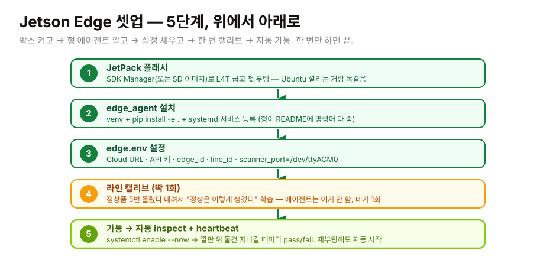

> 👆 **이 5단계가 전부임.** 1~3은 한 번 깔면 끝, 4는 딱 1회, 5는 켜두면 알아서 돎.
>
> ⚠ 단, 그 5단계 **전에** 부품을 박스 하나로 합치는 물리 조립(7.0)이 먼저임. 발주만 해놓고 박스로 안 합치면 OS 구울 SSD가 안 꽂혀 있음. 그래서 7.0부터.

### 7.0 Edge 박스 조립 — 부품을 박스 하나로 (20분) ⚠ **7.1 전에 먼저**

> 2.4 / 2.5 에서 시킨 부품들(Jetson 키트 E1~E5 + 디스플레이 D1~D6)이 다 왔지? 이제 그 부품 더미를 **"한 덩어리 박스"** 로 만든다. 이거 안 하고 7.1 가면 SSD 안 꽂힌 채로 "SSD에 OS 구워라" 가 돼서 멘붕옴. 순서대로.

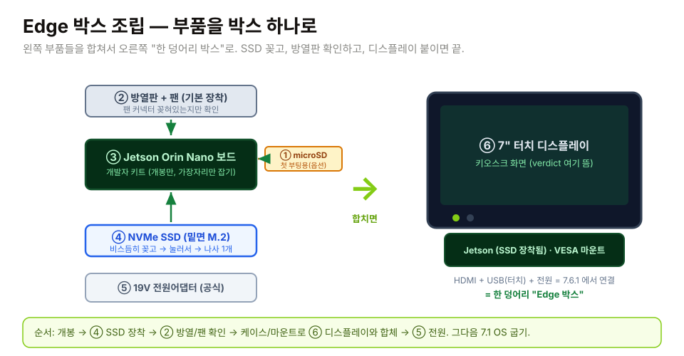

> 👆 **왼쪽 부품 → 오른쪽 박스 하나.** SSD는 보드 밑면 M.2에 꽂고, 방열판/팬은 기본 장착, 디스플레이는 마운트로 합체. 그림 순서 그대로.

#### 7.0.1 개봉 + 정전기 (3분)

1. 정전기방지 매트(T7) 위에서 작업. Jetson 키트 박스 까서 구성품 확인: **보드(방열판+팬 이미 장착됨)**, 안테나(있으면), 그리고 동봉 전원(없으면 E3 따로).
2. ⚠ **보드는 가장자리만 잡아.** 칩/커넥터 손대지 마. 작업 전에 금속(책상 다리 등) 한 번 만져서 몸의 정전기 빼.
3. 디스플레이(D1) 박스도 까서 **HDMI(D3)·터치USB(D4)·전원(D5)** 케이블 들어있나 확인. 없는 줄은 따로 산 거 맞춰 둬.

#### 7.0.2 NVMe SSD 장착 (5분) ★ 이게 "박스 만들기"의 핵심

> 키트만 사면 SSD가 안 꽂혀 있음. 네가 꽂아야 함. M.2 슬롯은 **보드 밑면**에 있음 (Orin Nano 캐리어보드 뒷면).

1. 보드를 살살 뒤집어. 밑면에 길쭉한 **M.2 Key-M 슬롯**(2280) 보임.
2. SSD(E2)를 슬롯에 **30도쯤 비스듬히** 끼워. 금색 핀이 다 들어가게 끝까지.
3. 반대쪽 끝을 **눌러서 수평으로** 내린 다음, **나사 1개**로 고정. (나사·스탠드오프는 보통 키트 또는 SSD에 동봉. 없으면 M2 x 3mm 나사.)
4. 헐겁게 들리면 다시. 덜 꽂힌 채 나사 조이면 SSD 인식 안 됨(8.10 참고).

#### 7.0.3 방열 / microSD / 케이스 (5분)

1. **방열판 + 팬**: Dev Kit은 기본 장착됨. **팬 4핀 커넥터가 보드에 꽂혀 있는지**만 눈으로 확인. (빠져 있으면 풀로드 때 스로틀링.)
2. **microSD(E4)**: 7.1에서 *방법 A(SD 부팅)* 로 갈 거면 슬롯에 꽂아둬. *방법 B(SSD 부팅)* 면 SD 없이 진행 (복구용으로 보관).
3. **케이스(E5, 옵션)**: 케이스 있으면 보드 안착 후 나사. 첫 대 데모는 케이스 없이 방열판 그대로 + 매트 위에서도 OK. (단, 먼지/합선 주의.)

#### 7.0.4 디스플레이와 합체 → "한 박스" (5분)

1. 디스플레이(D1)를 **VESA 75 마운트 / 데스크 스탠드(D6)** 에 결합.
2. Jetson을 같은 스탠드 뒤판이나 디스플레이 케이스 뒤에 케이블타이/벨크로로 붙여서 **둘이 한 덩어리로** 움직이게 해. (현장에선 이게 통째로 컨베이어 옆에 서는 "박스"가 됨.)
3. HDMI·터치USB·전원 **케이블 배선과 실제 연결은 7.6.1**에서 함 (지금은 물리적으로 한 데 모으고 선만 정리). 전원어댑터(E3)는 손 닿는 데 빼두고.
4. 케이블타이로 선 정리. 데모 중에 선 한 가닥 빠지는 게 데모 사망 1위임.

> 💡 **여기까지가 "박스 만들기".** 이제 손바닥보다 조금 큰 한 덩어리가 됐을 거임 — Jetson(+SSD) 뒤, 터치 화면 앞. 이게 공장 컨베이어 옆에 그대로 서는 그 박스임. 다음 7.1부터는 이 박스에 OS/소프트웨어 넣는 거.

> ⚠ 아직 전원 켜지 마 (또는 켜서 부팅만 확인하고 7.1로). OS는 7.1에서 굽는다.

### 7.1 JetPack 플래시 (1시간, 대부분 다운로드 대기)

Jetson은 그냥 작은 우분투 컴퓨터임. OS(JetPack = Ubuntu + NVIDIA 드라이버)부터 깔아야 함.

- **방법 A (쉬움, 추천)**: 공식 **microSD 이미지** ("Jetson Orin Nano Developer Kit SD Card Image") 다운받아서, microSD(E4)에 [Balena Etcher](https://etcher.balena.io) 로 구움 → Jetson에 꽂고 전원 → 부팅.
- **방법 B (SSD 부팅)**: 다른 우분투 PC에 **NVIDIA SDK Manager** 깔고 USB로 Jetson을 recovery 모드로 연결 → NVMe SSD(E2)에 플래시. 더 빠르고 안정적이라 데모/운영용으론 이게 나음.
- 첫 부팅하면 **우분투 설정 마법사** 나옴 (언어/계정/와이파이). 노트북에 우분투 까는 거랑 똑같음. 천천히 따라가.
- **인터넷 연결** (랜선 추천). ⚠ Cloud(docker) 돌리는 노트북이랑 **같은 네트워크(같은 공유기)** 에 있어야 함.
- 시간 대부분 다운로드 대기임. 켜놓고 깔판 만들어 (병렬).

### 7.2 edge_agent 설치 (10분)

Jetson 터미널(또는 SSH)에서 — 형이 준 명령어 그대로:

```bash
git clone https://github.com/gkjuwon-tech/hw.git
cd hw/edge_agent
sudo apt-get install -y python3-venv python3-pip
sudo python3 -m venv /opt/conet/edge_agent
sudo /opt/conet/edge_agent/bin/pip install -e .
sudo cp systemd/conet-edge-agent.service /etc/systemd/system/
sudo systemctl daemon-reload
```

아직 **start 는 안 함.** 설정(7.3) + 캘리브(7.4) 먼저 하고 7.5에서 켬.

### 7.3 edge.env 설정 (5분)

```bash
sudo mkdir -p /etc/conet
sudo nano /etc/conet/edge.env
```

아래 붙여넣고 `<...>` 부분만 네 값으로:

```ini
CONET_EDGE_CLOUD_URL=http://<노트북-IP>:8000
CONET_EDGE_API_KEY=ctk_live_xxxxxxxxxxxxxxxxxxxxxx
CONET_EDGE_ID=edge-line-7
CONET_EDGE_LINE_ID=line-7
CONET_EDGE_SCANNER_PORT=/dev/ttyACM0
CONET_EDGE_SCANNER_ROWS=16
CONET_EDGE_SCANNER_COLS=16
```

- `<노트북-IP>` = Cloud 돌리는 노트북의 **LAN IP** (예: `192.168.0.12`). ⚠ `localhost` 아님! Jetson 입장에선 노트북이 남의 컴퓨터임. 노트북에서 IP 확인: Win `ipconfig`, Mac/Linux `ifconfig` 또는 `ip a`.
- `CONET_EDGE_API_KEY` = **6.4에서 발급한 `ctk_live_...` 통째로.**
- Jetson에서 연결되는지 먼저 확인: `curl http://<노트북-IP>:8000/healthz` → ok 나와야 함. 안 나오면 노트북 방화벽이 8000 막은 거 (방화벽 허용 또는 노트북 8000 인바운드 열기).

### 7.4 스캐너 연결 + 라인 캘리브 (1회, 10분) ⚠ 제일 중요

PCB의 USB-C를 **Jetson에** 꽂아 (4.2). 잡혔는지 확인:

```bash
ls /dev/ttyACM*       # → /dev/ttyACM0 나오면 OK
```

`edge_agent` 는 **inspect(검사)만 하고 캘리브(정상 학습)는 안 함.** 그러니 에이전트 켜기 전에 **딱 한 번** 라인 만들고 정상 학습시켜야 함. 형이 캘리브 스크립트 줌 — Jetson에서 실행:

```python
# save as: ~/calibrate_once.py   (Jetson에서 1회만 돌림)
import serial, struct, requests, time
PORT = "/dev/ttyACM0"; BAUD = 921_600          # USB-CDC라 BAUD는 사실 무시됨
API  = "http://<노트북-IP>:8000"               # ← edge.env CLOUD_URL과 동일
KEY  = "ctk_live_xxxxxxxxxxxxxxxxxxxxxx"        # ← edge.env API_KEY와 동일
LINE = "line-7"                                # ← edge.env LINE_ID와 글자까지 동일!
H = struct.Struct("<IHHIIHH"); MAGIC = 0x434F4E54
hdr = {"Authorization": f"Bearer {KEY}", "Content-Type": "application/json"}

def post(p, j):
    r = requests.post(API + p, json=j, headers=hdr, timeout=5)
    r.raise_for_status(); return r.json()

def read_frame(s):
    while True:
        if s.read(1) != b"T": continue
        m, r, c, seq, ts, crc, _ = H.unpack(b"T" + s.read(H.size - 1))
        if m != MAGIC: continue
        return list(s.read(r * c))

# 1) 라인 생성 (이미 있으면 409 → 무시)
try: post("/v1/lines", {"id": LINE, "customer_tag": "demo", "rows": 16, "cols": 16})
except Exception as e: print("line exists/err:", e)
# 2) 정상품 5장 버퍼링 → 3) 캘리브
with serial.Serial(PORT, BAUD, timeout=1) as s:
    print("정상품을 5번 올렸다 내려라 (위치 살짝씩 바꿔서)…")
    for i in range(5):
        post(f"/v1/lines/{LINE}/frames", {"data": read_frame(s)})
        print(f"  {i+1}/5 buffered"); time.sleep(2)
    print("calibrate:", post(f"/v1/lines/{LINE}/calibrate", {}))
print("캘리브 끝. 이제 7.5 로.")
```

```bash
/opt/conet/edge_agent/bin/pip install pyserial requests
/opt/conet/edge_agent/bin/python ~/calibrate_once.py
```

- 정상품(빵 1개·무거운 책 등) 5번 올렸다 내려. 2초마다, 위치 살짝씩 바꿔서 (같은 자리만 누르면 그 자리만 학습함).
- ⚠ `LINE` 은 `edge.env` 의 `CONET_EDGE_LINE_ID` 와 **글자 하나까지 똑같이.** 다르면 에이전트가 "캘리브 안 된 라인" 을 inspect하려다 전부 무시함(409). 제일 흔한 실수임. 똑같이.

### 7.5 가동 + 확인 (5분)

```bash
sudo systemctl enable --now conet-edge-agent          # 가동 + 부팅 자동시작
/opt/conet/edge_agent/bin/conet-edge-agent status     # 설정 + tegrastats 한 번 출력
journalctl -u conet-edge-agent -f                     # 실시간 로그 (Ctrl+C로 빠져나옴)
```

- 깔판 위에 물건 지나가면 → 로그에 verdict 흐르고, 노트북 Cloud엔 heartbeat(cpu/gpu/온도/추론지연)가 박힘.
- 정상품 = `pass`, 이상한 거(찌그러짐·빈 거·이물질) = `fail`.
- **재부팅해도 자동 시작** (enable 했으니까). 이게 "공장에 두고 오는" 상태임. 노트북 안 켜도 박스 혼자 돎.

이 시점 = **진짜 데모 가능.** 노트북 위 데모가 아니라, **손바닥만 한 박스가 깔판 읽어서 클라우드로 판정을 쏘는 거.** 영상 찍어서 형한테. 이건 투자자한테 "이거 그대로 공장 갑니다" 라고 말할 수 있는 물건임. 자랑해. 진짜로 자랑해도 됨.

> 💡 캘리브를 노트북에서 하면 안 되냐? 안 됨 — 스캐너가 Jetson에 꽂혀 있으니 캘리브도 Jetson에서. 어차피 1회임.

> 💡 **여기까지 왔으면 너 진짜 엣지 디바이스 엔지니어 됨.** 한 달 전엔 LED 극성도 몰랐는데, 지금 압력센서 만들고 → Jetson 플래시하고 → 데몬 띄우고 → AI에 연결했음. 형이 인정함. (이번엔 두 번 인정. 진짜 고생했다.)

### 7.6 터치 디스플레이 + 키오스크 모드 (30분) ⚠ **이걸 해야 진짜 "공장 모드"**

> 7.5까지가 "박스가 알아서 돈다" 였다면, 7.6은 "**박스에 화면 박아서 박씨 아저씨가 손가락으로 조작한다**" 임. .exe / .dmg 다 잊어. Cognex 박스처럼 디스플레이가 박스 일부가 됨.

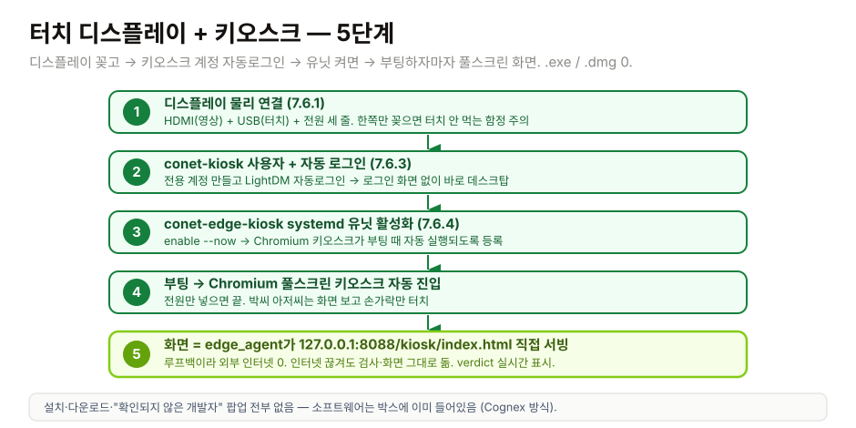

> 👆 다이어그램 위에서 아래로. 한 번만 해두면 끝.

#### 7.6.1 디스플레이 물리 연결 (10분)

1. 디스플레이 박스를 깐다. **HDMI 케이블(D3)** + **터치용 USB(D4)** + **전원 USB(D5)** 세 줄 들어있는지 확인.
2. Jetson 끔: `sudo poweroff`. 전원 빠진 다음에 케이블 꽂아 (Jetson HDMI 핫플러그가 가끔 무서움).
3. Jetson HDMI → D3 → 디스플레이 HDMI 입력.
4. Jetson USB-A → D4 → 디스플레이 "Touch" / "USB" 포트. (디스플레이 박스에 라벨 있음.)
5. **디스플레이 전원** = 별도 5V 3A 어댑터(D5). Jetson USB로 따려는 유혹 참고 어댑터로 가. (전류 부족하면 화면 깜빡임.)
6. VESA 75 마운트나 데스크 스탠드(D6)에 디스플레이 박아. 첫 대 데모는 책상 스탠드도 OK.
7. Jetson 켜.

부팅 후 Ubuntu 데스크탑이 디스플레이에 떠야 정상. 안 뜨면 8.13.

#### 7.6.2 터치 캘리브레이션 (5분, 한 번만)

대부분 디스플레이는 꽂자마자 멀티터치 인식. 확인:

```bash
xinput list   # 출력에 "WingCool Inc." 또는 "Touchscreen" 같은 게 보여야 함
```

손가락으로 데스크탑 터치 → 마우스 커서가 그 자리로 점프하면 OK. 안 가면:

- HDMI/USB 둘 다 꽂혔는지 확인 (한쪽만 꽂으면 영상은 나오는데 터치 안 됨 함정).
- 멀티 디스플레이일 때 터치가 노트북 화면을 따라가는 경우 있음: `xinput map-to-output <touch-id> HDMI-0` 으로 강제 매핑.
- 7" / 10" 둘 다 USB 1.1 HID 라서 드라이버 따로 안 깔아도 됨.

#### 7.6.3 kiosk 사용자 + 자동 로그인 (5분)

```bash
sudo adduser --disabled-password --gecos "" conet-kiosk
sudo mkdir -p /var/lib/conet/kiosk-profile
sudo chown -R conet-kiosk:conet-kiosk /var/lib/conet/kiosk-profile
```

자동 로그인 (Ubuntu LightDM 기준):

```bash
sudo nano /etc/lightdm/lightdm.conf
# 아래 두 줄 추가
[Seat:*]
autologin-user=conet-kiosk
autologin-user-timeout=0
```

저장 → 재부팅 → 로그인 화면 거치지 않고 conet-kiosk 데스크탑으로 바로 부팅되면 성공.

> 💡 GNOME 쓰는 JetPack 이미지는 `gnome-control-center` → Users → Automatic Login 으로 GUI에서도 할 수 있음.

#### 7.6.4 conet-edge-kiosk systemd 유닛 (5분)

```bash
sudo apt-get install -y chromium-browser curl
sudo cp /home/ubuntu/hw/edge_agent/systemd/conet-edge-kiosk.service \
    /etc/systemd/system/
sudo install -d -o conet-kiosk -g conet-kiosk /var/lib/conet/kiosk-profile
sudo systemctl daemon-reload
sudo systemctl enable --now conet-edge-kiosk.service
```

확인:

```bash
systemctl status conet-edge-kiosk.service
curl -fsS http://127.0.0.1:8088/kiosk/status | jq .
```

- 상태: `active (running)` 이고 Chromium 프로세스가 conet-kiosk 사용자로 돌고 있어야 함.
- 8088 응답: edge_agent 가 띄운 JSON 상태 (`edge_id`, `fps`, `inference_p50_ms` 등) 가 와야 함.

#### 7.6.5 화면 보호기 / 절전 비활성 (3분)

24시간 가동이니까 디스플레이가 절전 모드 들어가면 안 됨:

```bash
# X11 절전 끄기 (autologin 세션에서 한 번만)
sudo -u conet-kiosk DISPLAY=:0 xset s off
sudo -u conet-kiosk DISPLAY=:0 xset -dpms
sudo -u conet-kiosk DISPLAY=:0 xset s noblank

# 부팅마다 적용되려면 /home/conet-kiosk/.xprofile 에 위 세 줄 영구 등록
```

#### 7.6.6 동작 확인 (2분)

1. 재부팅: `sudo reboot`.
2. 부팅 끝나면 **로그인 화면 없이** 바로 검은 Chromium 키오스크가 풀스크린으로 뜬다. 화면에:
   - 좌상단: `Conet Tactile` + 초록 점 + `edge-...` / `line-...`
   - 가운데: "Last verdict — score 0.00"
   - 아래쪽: `Calibrate` / `Switch recipe` / `Acknowledge` 큰 버튼
3. 깔판 위에 정상품 올려보면 verdict 가 `pass` 로 바뀌고 score 가 실시간 갱신.
4. 손가락으로 `Calibrate` 눌러보면 버튼이 짙어지면서 "Calibrate · queued" 로 바뀜 (v0.1에서는 큐만 됨, 실제 호출은 v0.2).

이 시점 = **공장에 그대로 들고 갈 수 있는 박스 완성.** 노트북 0대. .exe 0개. .dmg 0개. 박씨 아저씨가 손가락으로 다 함. Cognex 박스에 비교해도 안 부끄러움.

> 💡 **왜 별도 키오스크 HTTP 서버야? FastAPI 백엔드 두면 안 됨?** edge_agent 는 일부러 의존성 가볍게 가는 중. 키오스크용으로 `uvicorn` + `fastapi` 또 끌고 들어가는 건 양산용 이미지에서 메모리/부팅시간 낭비. stdlib `asyncio` HTTP 만으로 충분함. 그래서 `edge_agent/kiosk.py` 에 자체 서버.

> 🚨 **다음 라인(2호기)부터는** D6 스탠드 말고 진짜 **VESA 75 산업용 암** 으로 함체에 박아라. 컨베이어 진동 + 기름 환경이라 책상 스탠드는 1주일 만에 흔들림. 첫 대 데모만 책상 OK.

---

## 8. 트러블슈팅 — **반드시 한 번은 겪는 문제들**

> 여기 있는 거 전부 형이 미리 겪어봐서 적어놓은 거임. "이런 것까지 적어놨어?" → 응. 너 막힐 거 다 알아서. 막히면 먼저 여기부터 봐. 여기 있으면 형한테 톡하지 말고 그냥 해결해.

### 8.1 "PCB 가 포트에 안 잡혀"

| 증상 | 해결 |
|------|------|
| 포트 목록에 안 보임 | 1) USB-C 케이블이 **데이터** 가능 케이블인지 확인 (충전전용 케이블 흔함! 폰 충전기 딸려온 케이블 중에 데이터 안 되는 거 많음). 다른 케이블로. 2) Windows: [Espressif USB 드라이버](https://www.espressif.com/en/support/download/other-tools) 설치. 3) 케이블 방향 뒤집어서 다시 꽂아. |
| 잡혔는데 업로드 실패 | PCB 의 **BOOT 버튼** 누른 채로 **RESET 버튼** 짧게 눌렀다 떼고 → BOOT 도 떼기 (= 부트로더 모드 진입). 그 후 업로드 화살표. |
| "Failed to connect" | 위 부트로더 모드 시도. 또는 Arduino IDE 의 **Tools → Upload Speed → 460800** 으로 낮춰서 재시도. |

### 8.2 "프레임이 다 0" (또는 avg 가 안 변함)

| 증상 | 해결 |
|------|------|
| 모든 셀 ADC 값 = 0 | 깔판 ↔ PCB FFC 케이블 안 꽂힘 or 케이블 방향 반대. 걸쇠 제대로 닫혔는지 확인. |
| 누르지도 않았는데 4095 (최대값) | 깔판이 단락 (위·아래 천이 직접 닿음). Velostat 한 겹 더 추가. |
| 한 행 (또는 한 열) 만 0 | 그 줄의 FFC 핀 접촉 불량. 멀티미터로 그 줄 끝단~PCB 핀 도통(연결) 확인. |
| avg 가 누를 때 변하긴 하는데 미세함 | 정상일 수도. 근데 4.1 멀티미터 검사 다시 해서 셀 반응 확인. |

### 8.3 "Cloud 가 500/4xx 토함"

`docker compose logs api` 로 로그 봐 (새 터미널, `hw/backend` 위치). 대부분:
- **inspect가 409** → 라인이 아직 calibrated 아님. 7.4 캘리브 스크립트 먼저 돌려. (에이전트는 캘리브 안 함!)
- frame 크기 안 맞음 → 라인 만들 때 rows/cols 가 16×16 인지, edge.env의 ROWS/COLS도 16인지 확인.
- 401/403 → API 키가 없거나 read-only 임. 6.4에서 **read_write** 스코프로 다시 발급.

### 8.4 "verdict 가 다 pass" (불량인데도 pass)

- 캘리브레이션 때 **다양한 정상품** 5개 줬어야 함. 같은 거만, 같은 위치에만 올리면 그것만 정상으로 학습해서 둔감해짐. 위치 바꿔가며 다시 캘리브레이션.
- 임계값이 너무 높음 → `PATCH /v1/lines/{id}` 로 `threshold_score` 를 기본 4.0 → 2.5 로 낮춰. (http://localhost:8000/docs 에서 PATCH 찾아서 버튼으로 해도 됨.)

### 8.5 "verdict 가 다 fail" (정상인데도 fail)

- 캘리브레이션 안 됐거나, 캘리브레이션 때 흘린 거랑 지금 올리는 거랑 너무 다름.
- 임계값이 너무 낮음 → `threshold_score` 를 2.5 → 4.0 으로 올려.
- 깔판이 캘리브레이션 후에 움직였음 (위치가 바뀌면 압력 지도가 달라짐). 깔판 고정하고 다시.

### 8.6 "라미네이팅 후 깔판 사망"

- 라미네이터 온도 너무 높음 (110°C 이내였어야 함).
- 라미네이팅 **전에** 멀티미터 검사 했어야 함 (4.1). 안 했지? 다음엔 해.
- 새로 만들어. 이게 그 "한 장 망가뜨릴 거" 임 (2.2 에서 예고함). 학습비라고 생각해. Velostat 은 싸. 멘탈만 챙겨.

### 8.7 "JLCPCB BOM 매칭에 빨간 줄"

- 재고 없음 (Out of Stock). 그 줄 **Alternative** 클릭 → 형이 BOM 의 주석/비고 칸에 적어놓은 대체 부품번호 (LCSC "C..." 번호) 따라가.
- 1순위/2순위 대체품 둘 다 없으면 → 형한테 톡. **부품 행 번호 + 스크린샷** 같이. (또 패턴. 뭘 + 어디.)

### 8.8 "통관 막힘 / 박스가 안 와"

- 개인통관고유부호 누락 또는 오타. [unipass.customs.go.kr](https://unipass.customs.go.kr) 에서 본인 번호 확인하고 배송사(DHL)에 전달.
- 합산 $150 초과 → 부가세 + 관세 청구됨. 청구서 결제하면 풀림. (그래서 2.1 에서 "표에 있는 것만 사" 라고 한 거임.)
- DHL 에서 문자/메일 옴. 무시하지 마. 통관 서류 요청이면 바로 응답.

### 8.9 "Docker 가 안 돌아"

- "Cannot connect to Docker daemon" → Docker Desktop (고래 아이콘) 안 켜짐. 켜.
- 포트 8000 already in use → 다른 게 8000 쓰고 있음. 그거 끄거나, `docker compose down` 후 다시.
- 빌드 중 멈춤 → 인터넷 확인. 이미지 받는 중일 수 있음. 3분은 기다려봐.

### 8.10 "Jetson 이 안 켜져 / 부팅 중 꺼짐"

- **전원 부족이 90%.** 공식 19V 어댑터 또는 충분한 W의 USB-C PD(45W+) 써. 폰 충전기로 굴리면 부팅 중 꺼지고 SD/SSD 깨짐.
- 모니터 안 나옴 → HDMI/DP 케이블·포트 확인, 첫 부팅은 시간 좀 걸림(1~2분).
- microSD 이미지 잘못 구워짐 → Etcher로 다시. 8GB 모델 이미지 맞는지 확인.
- **SSD 인식 안 됨 / SSD 부팅(방법 B) 실패** → 7.0.2 다시. M.2에 SSD가 끝까지 안 꽂힌 채 나사만 조인 경우가 대부분. `lsblk` 쳐서 `nvme0n1` 안 보이면 다시 비스듬히 꽂고 눌러 고정. 그래도 안 보이면 다른 슬롯/다른 SSD.

### 8.11 "/dev/ttyACM0 가 없음 (Jetson이 스캐너를 못 봄)"

- `ls /dev/ttyACM*` 비어있음 → PCB USB-C가 Jetson에 안 꽂힘 / 데이터 안 되는 케이블 / 펌웨어 안 구워짐(5절).
- `dmesg | tail` 쳐서 USB 연결 로그 보기. 안 뜨면 케이블·포트 바꿔.
- 포트가 `/dev/ttyACM1` 로 잡히면 → edge.env의 `CONET_EDGE_SCANNER_PORT` 를 거기에 맞춰.
- 권한 에러(permission denied) → systemd 서비스는 이미 DeviceAllow 걸려있음. 수동 실행 시엔 `sudo usermod -aG dialout $USER` 후 재로그인.

### 8.12 "에이전트는 도는데 Cloud에 아무것도 안 박힘"

- `journalctl -u conet-edge-agent -f` 로 로그 봐.
- `cloud.request_failed` → `CONET_EDGE_CLOUD_URL` 이 `localhost` 로 돼있을 확률. **노트북 LAN IP** 로 바꿔. Jetson에서 `curl http://<노트북-IP>:8000/healthz` 먼저 통과시켜.
- `inspect` 가 조용히 무시됨 → 라인 캘리브 안 됨(409). 7.4 다시. `CONET_EDGE_LINE_ID` 와 캘리브 때 쓴 `LINE` 이 똑같은지 글자 대조.
- `enroll_failed` / 401 → API 키 틀림. 6.4 재발급 후 edge.env 갱신 → `sudo systemctl restart conet-edge-agent`.
- edge.env 고쳤으면 **항상 `sudo systemctl restart conet-edge-agent`** 해야 반영됨.

### 8.13 "디스플레이 / 키오스크 가 이상함" (7.6 관련)

| 증상 | 해결 |
|------|------|
| HDMI 꽂아도 화면 깜깜 | Jetson 끄고 → 디스플레이 전원(D5) 먼저 켜고 → HDMI 꽂고 → Jetson 켜. 1280×720 / 1024×600 모드 매뉴얼로 잡으려면 `xrandr --output HDMI-0 --mode 1024x600` (모드 없으면 `cvt` 로 만든 다음 `xrandr --newmode`). |
| 터치는 되는데 마우스가 노트북 화면 가서 박힘 | 멀티 디스플레이 매핑 안 됨. `xinput list` 로 터치 디바이스 ID 확인 후 `xinput map-to-output <id> HDMI-0`. |
| Chromium 키오스크는 떴는데 "Site can't be reached" | `curl -fsS http://127.0.0.1:8088/kiosk/status` 가 200 인지 먼저. 안 되면 `systemctl status conet-edge-agent` 가 active 인지 확인 → 키오스크 유닛은 그 다음. |
| 키오스크 풀스크린이 아닌 일반 창으로 뜸 | 자동로그인 사용자가 `conet-kiosk` 가 아닐 확률 (다른 유저로 로그인 됨). `/etc/lightdm/lightdm.conf` 다시 확인 후 재부팅. |
| 부팅 후 10초쯤 "Site can't be reached" 보이다가 정상화 | 정상. `conet-edge-agent` 가 부팅 후 8088 잡는 데 약간 시간 걸림. 키오스크 유닛 `ExecStartPre` 가 최대 30초 기다림. |
| 화면이 30분 뒤에 검게 꺼짐 | 7.6.5 절전 비활성 안 함. `xset s off; xset -dpms; xset s noblank` 다시 + `.xprofile` 에 영구 등록. |
| 터치가 안 먹는데 영상은 나옴 | 저항식(resistive) 디스플레이 산 거. 정전식(capacitive)으로 환불·교체. 첫 대 데모는 일단 마우스 꽂아서 진행. |

---

## 9. 너 진짜 할 일 (체크리스트) — **3~4주 컷**

이거 그대로 따라가. 한 칸씩 체크하면서. 못 하겠으면 어디서 막혔는지 형한테 톡 (사진 + 어디까지 + 어디서).

### Week 1 — 발주 (월~화), 다섯 군데 한 방에

- [ ] [`HOW_IT_WORKS.md`](./HOW_IT_WORKS.md) 읽음 (30분)
- [ ] 이 문서 0~3절 읽음 (40분) ← 지금 읽고 있는 거. 절반 했네.
- [ ] 개인통관고유부호 발급 (10분)
- [ ] Adafruit (M1~M3) 장바구니 (15분)
- [ ] 디바이스마트 (M4, M7) 장바구니 (10분)
- [ ] 쿠팡 (M5, M6, 도구 T1~T7) 장바구니 (20분)
- [ ] **JLCPCB SMT 풀턴키 5장** (40분) ⭐ ← Gerber PR 머지된 후
- [ ] **Jetson Edge (Orin Nano 8GB Dev Kit + SSD + 전원 + microSD)** 장바구니 (20분) ⭐NEW
- [ ] 다섯 군데 다 담고 → **결제 직전 형 호출** (연구비 카드), 증빙 캡처
- [ ] 형한테 톡: "다섯 군데 다 담음. 디마/쿠팡/Adafruit/Jetson/JLCPCB. 결제 ㄱ?"

### Week 2 — 깔판 만들기 + Jetson 도착 → 셋업 (병렬)

- [ ] 부품 박스 다 까서 한 곳에 모음 (15분)
- [ ] 종이에 16×16 격자 그림 (15분)
- [ ] Velostat 자르고 가로줄 16가닥 깔기 (30분)
- [ ] 세로줄 16가닥 + 절연층 (30분)
- [ ] **멀티미터 8~10셀 검사 → 통과** (15분) ← 라미네이팅 전에!
- [ ] 멀티미터 저항 변하는 영상 형한테 보냄 (5분)
- [ ] 라미네이팅 (30분)
- [ ] **Jetson 도착 → Edge 박스 조립** (7.0): SSD 장착 + 방열/팬 확인 + 디스플레이 마운트로 한 덩어리 (20분)
- [ ] **JetPack 플래시 + 첫 부팅** (7.1, 1시간 대부분 대기)
- [ ] **edge_agent 설치 (venv + systemd)** (7.2, 10분)

### Week 3 — PCB 도착 → 펌웨어 + Cloud + Edge 가동 + 데모

- [ ] PCB 5장 박스 도착, ESD 백 열기 + 육안 검사 (15분)
- [ ] 깔판 ↔ PCB FFC 케이블 연결 (J1=행, J2=열) (10분)
- [ ] Arduino IDE 설치 + 펌웨어 굽기 (USB CDC On Boot 켜는 거 잊지 마!) (30분)
- [ ] `pyserial` 로 프레임 흐름 확인 (깔판 누르면 avg 올라감) (10분)
- [ ] Docker Desktop 설치 + `docker compose up` (15분)
- [ ] **API 키 발급** (6.4, 2분)
- [ ] **PCB USB-C를 Jetson에 꽂기** + `/dev/ttyACM0` 확인 (5분)
- [ ] **edge.env 설정** (CLOUD_URL=노트북 IP, API 키, line_id) (7.3, 5분)
- [ ] **캘리브 1회** (`calibrate_once.py`, 정상품 5번) (7.4, 10분)
- [ ] **`systemctl enable --now conet-edge-agent`** → 가동 (7.5, 5분)
- [ ] 깔판 위 정상품=pass / 이상한 거=fail 영상 찍기 (10분)
- [ ] 형한테 영상 + **"진짜 됨. 박스 혼자 돌아감"** 톡 ⭐

이 시점 = **둘 다 투자자 미팅 잡을 수 있음.** 그것도 "노트북 데모" 가 아니라 **공장에 그대로 들고 갈 Edge 박스가 혼자 돌아가는** 데모. 네 손으로 만들었으니까 당당하게 발표해.

---

## 10. 마지막 — 약 좀 올림 (사랑을 담아)

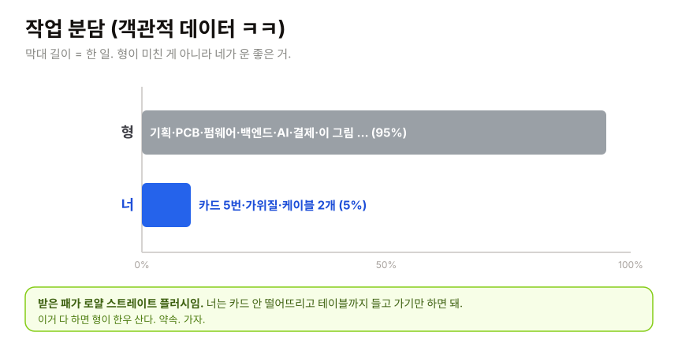

> 자, 정리해보자. 표로. 객관적으로.
>
> | 한 일 | 누가 |
> |------|------|
> | 회사 아이템 기획 | 형 |
> | 시장 분석 + 모트 설계 | 형 |
> | 랜딩페이지 디자인 + 카피 | 형 |
> | 가격 모델 설계 | 형 |
> | FastAPI 백엔드 (멀티테넌시 + auth + 가격 API + drift + 웹훅 + rate limit + Prometheus + Alembic + Docker + 테스트 60개+) | 형 |
> | **스트라이프 결제 연동 (라이브/목업 + 웹훅 서명 검증)** | 형 (방금) |
> | 펌웨어 (ESP32-S3 + MUX 스캔 + USB CDC + CRC + 200 Hz 프레임 포맷) | 형 |
> | PCB schematic + layout | 형 |
> | JLCPCB BOM + CPL + Gerber | 형 |
> | 공장에서 깔리는 깔판 설계 | 형 |
> | **edge_agent (Jetson 데몬: 스캐너 read + inference + heartbeat + spool)** | 형 |
> | 이 문서 (← 너 손에 들린 거) | 형 |
> | **부품값 ~110만원 (연구비)** | 형 (이번엔 돈도 형이) |
>
> 그리고 **너 할 거**:
>
> | 할 일 | 난이도 |
> |------|------|
> | 발주 장바구니 채우기 (결제는 형) | 유치원 |
> | 가위질 한 번 | 유치원 |
> | 케이블 2개 꽂기 (J1=행, J2=열) | 유치원 + 주의력 |
> | Arduino IDE 클릭 3번 (✓ → → / USB CDC 켜기) | 초등 저학년 |
> | `docker compose up` 한 줄 | 복붙 |
> | Jetson: JetPack 굽고 → 에이전트 깔고 → edge.env 채우고 → 캘리브 1회 | 초등 고학년 (복붙 위주) |
>
> 봐. 이번엔 **돈까지 형이 냈어.** 연구비라 형 주머니는 아니지만, 발주·증빙·소명 다 형이 떠안는 거임. 너는 손만 움직이면 됨. 받은 패가 로얄 스트레이트 플러시 정도가 아니라 그냥 딜러가 너 편임.
>
> 그러니까 이번엔 진짜로 **1대 끝까지 네가 만들어.** 돈도 안 내는데 손까지 안 움직이면 그건 공동창업자가 아니라 그냥 구경꾼임. Jetson 위에서 박스 혼자 돌아가는 영상 찍어서 보내. 그 영상이 우리 시드 투자 덱 첫 장 들어감.
>
> 막히면 톡. **"안 됨"** 만 보내지 마. **사진 + 어디까지 + 어디서.** 세 개. 항상 세 개. 안 그러면 형도 답 못 하고, 너만 멈춰 있고, 회사만 늦어짐.
>
> 인두에 손 대지 마라. 진짜로. (세 번째 경고임. 데이는 사람 꼭 있음. 너 아니길.) Jetson 전원도 켠 채로 SSD 뽑지 마.
>
> 이거 다 하면 형이 진짜로 밥 산다. 한우. 약속. (연구비 아니고 형 카드로. 그 정돈 해야지.)
>
> 가자.
>
> — 형
