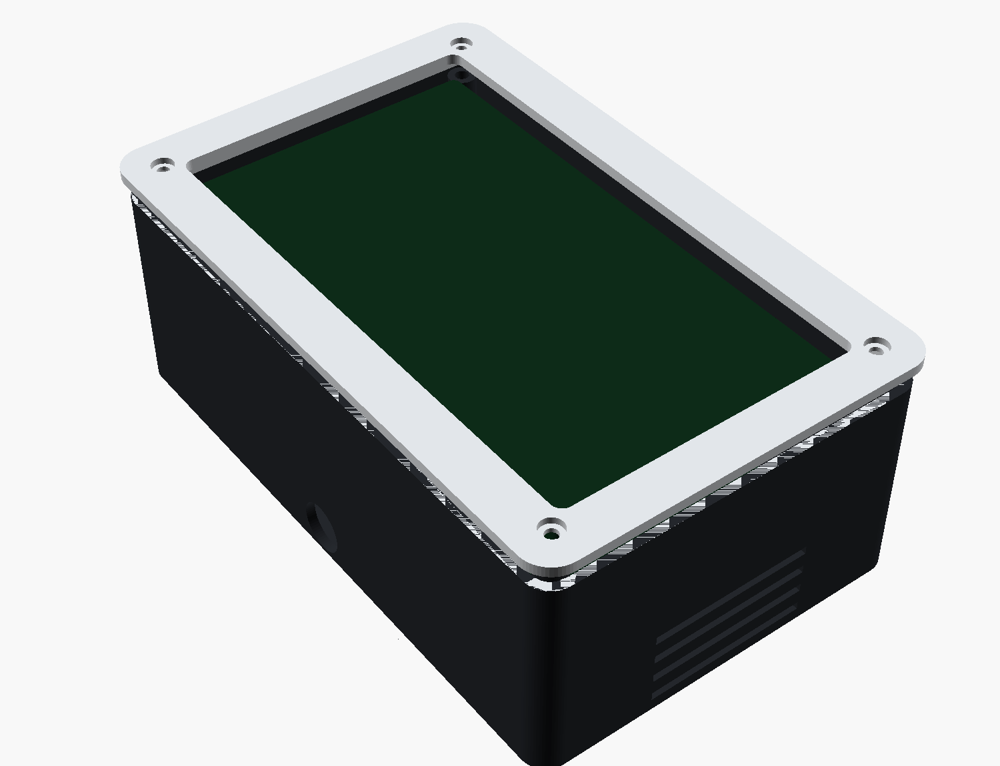

# Tactile Edge — 3D-printed enclosure

A line-side vision-sensor "product" shell (Cognex/Keyence register) so we
ship an *appliance*, not a bare NVIDIA dev kit zip-tied to a stand. The 7"
touch display sits behind a crisp **chamfered bezel** that stands slightly
proud of the **body** (the monitor-frame look); the Jetson Orin Nano
Developer Kit (heatsink/fan and all) tucks into the body behind it; the
**sides** carry a machined **vent grille**; the **back plate** carries a
**VESA-75** mount and a **cable exit**; the back edge is chamfered so the
unit reads as "floating". All styling is *subtractive* (chamfers, fillets,
slots) — no thin protruding decoration to snap off. Two printed parts screw
together with M3 heat-set inserts.



```
   front  ┌───────────────────────┐
   bezel  │  ┌─────────────────┐  │   ← window over the active area
          │  │   7" display    │  │
          │  └─────────────────┘  │
          └───────────┬───────────┘
                      │  M3 screws → inserts in the body bosses
   body   ┌───────────┴───────────┐
          │  Jetson Orin Nano on   │   ← standoffs lift the board for airflow
          │  4 standoffs, vents +  │
          │  cable exit + VESA-75  │
          └───────────────────────┘
```

## Files

| File | What |
|---|---|
| `edge_enclosure.scad` | Parametric model. One file, two printable parts. |

## Print it

No printer? Export the STLs and send them to a print service (≈ ₩30–50k).

```bash
# needs OpenSCAD (https://openscad.org)
openscad -D 'part="body"'  -o edge_body.stl  edge_enclosure.scad
openscad -D 'part="bezel"' -o edge_bezel.stl edge_enclosure.scad
# or open the file and set part="preview" to eyeball the assembly first
```

Both parts export as clean **2-manifold** STL — verified with OpenSCAD 2021.01.
The `preview.png` above is rendered straight from this `.scad`.

**Recommended print settings**

- **Material: PETG** (not PLA). The Jetson runs warm and a sun-side factory
  window will soften PLA — PETG holds up. ASA/ABS are fine too.
- Layer height 0.2 mm, **4 walls**, 25–35 % infill.
- Body: print open-face-up (no supports needed for the vents/bosses).
- Bezel: print face-down on the bed for a clean front face.
- Heat-set inserts: melt M3 brass inserts into the body bosses and the
  board standoffs with a soldering iron.

## Hardware (BOM)

| # | Part | Qty | Note |
|---|------|----:|------|
| C1 | PETG filament | ~150 g | one box ≈ a fraction of a 1 kg spool |
| C2 | M3 brass heat-set inserts | 8 | 4 bezel corners + 4 board standoffs |
| C3 | M3 × 8 mm screws (cap/countersunk) | 4 | bezel → body |
| C4 | M2.5 × 5 mm screws | 4 | Jetson board → standoffs (match your board) |
| C5 | VESA-75 bracket / desk stand | 1 | reuse D6 from the build guide |

## ⚠ Before the long print: confirm the dimensions

Every number in the `measured inputs` block of the `.scad` is **nominal**.
Measure your actual hardware and update them, then test-fit:

- `disp_w/h/th`, `win_w/h` — your exact 7" module + its visible active area.
- `jet_holes` — the **board mounting-hole pattern** of your dev kit. This is
  the one that bites: get the 4 [x, y] offsets right or the board won't sit.
- Print a **bezel-corner test coupon** (or just the bezel) first to dial in
  the insert/screw fit before committing to the multi-hour body print.

The geometry is **render- and manifold-verified** (OpenSCAD 2021.01), but it
has **not been physically printed / test-fit** yet — so it's a tweakable
starting point, not a guaranteed drop-in. See `HARDWARE_BUILD_GUIDE.md` §2.6
and §7.0 for where it slots into the build.
